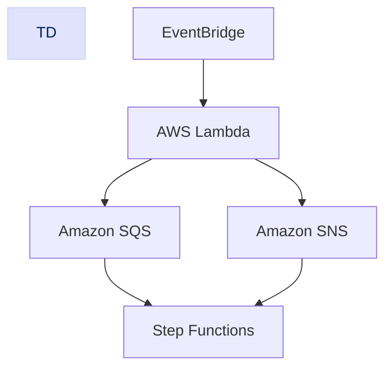
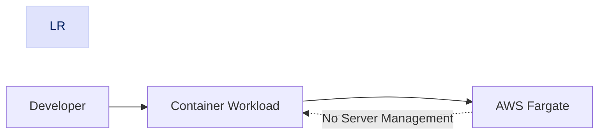
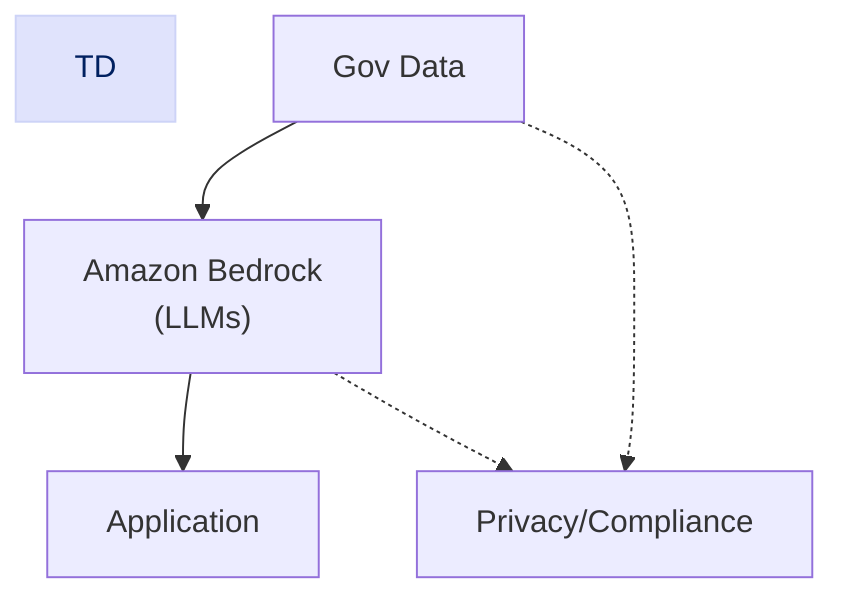
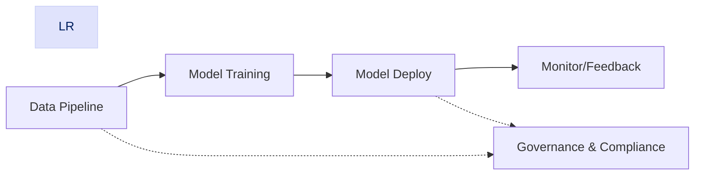
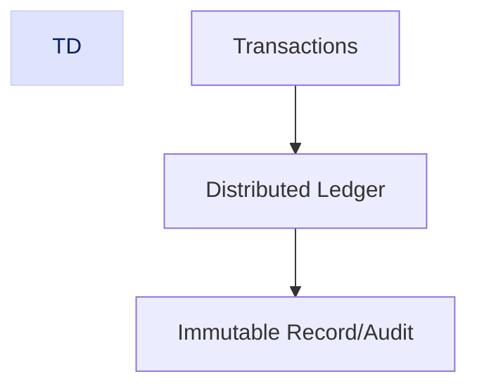
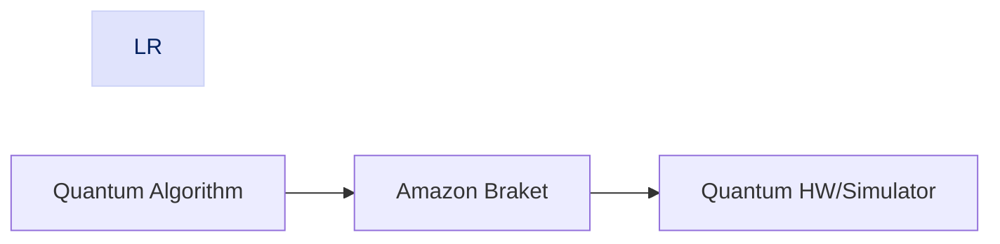
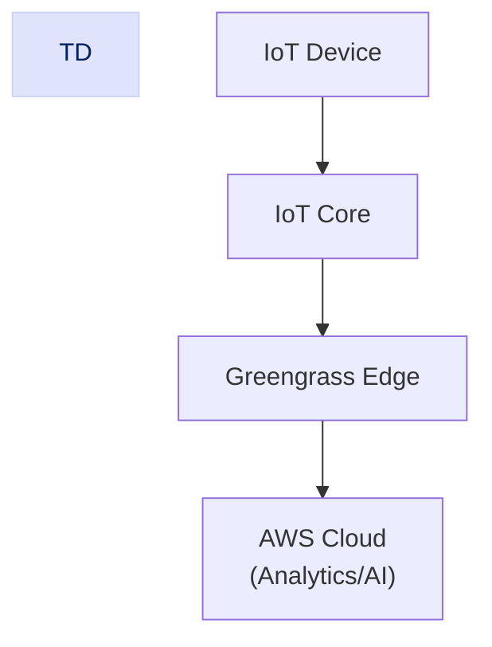

# Section 15: Advanced AWS Topics & Emerging Technologies

_AWS evolves rapidly; architects must stay current to build secure, innovative solutions in government/classified settings. This section covers key advanced areas._

## Serverless & Event-Driven Architectures

Serverless abstracts infrastructure, letting you focus on code. Key services:

- **AWS Lambda** – run code without managing servers
- **Amazon SQS/SNS** – messaging & notifications
- **EventBridge/Step Functions** – event routing & workflow orchestration

Design for scalability, resilience, & cost efficiency.

### Serverless Containers ( AWS Fargate )

- **AWS Fargate:** Run containers sans server management.
- Best for microservices, batch jobs—no EC2/EKS ops.

## Machine Learning & AI

- **AWS AI/ML Suite:** Infra to high-level AI
- **Amazon Bedrock:** Integrate, fine-tune generative AI/LLMs securely.
- Key: Data privacy, responsible AI, compliance.

### MLOps & Data Governance

- Automate pipelines, model deployment, monitoring.
- Maintain data quality, lineage, compliance.

## Blockchain & Distributed Ledgers

- **Amazon Managed Blockchain:** Easily deploy blockchain (Hyperledger, Ethereum).
- Use-cases: Transparency, digital identity, audit trails.

## Quantum Computing

- **Amazon Braket:** Build/test quantum algorithms on real/simulated hardware.
- Relevant for research, cryptography, optimization.

## Edge & IoT

- **AWS Wavelength:** AWS at 5G edge, ultra low-latency.
- **AWS Outposts:** AWS services on-premises/edge, supports residency & air gap.
- **AWS IoT Suite:** Connect/analyze billions of devices securely & compliantly.

## Conclusion

Continuous learning is essential. Architects must evaluate and apply advanced AWS technologies to build future-proof, secure cloud solutions for government/classified use.
