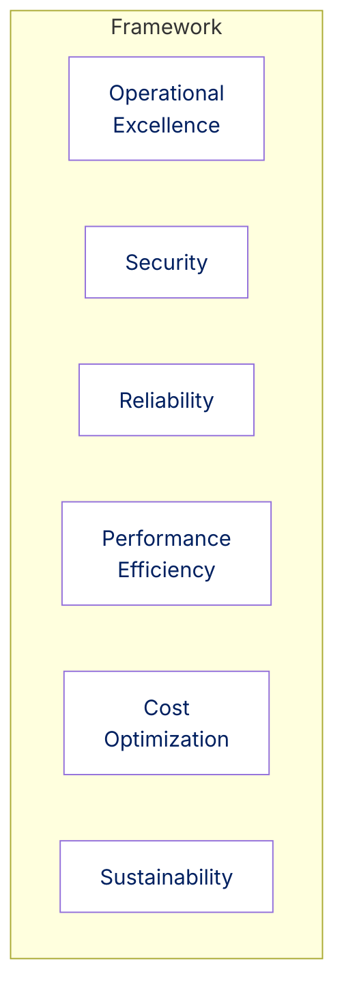
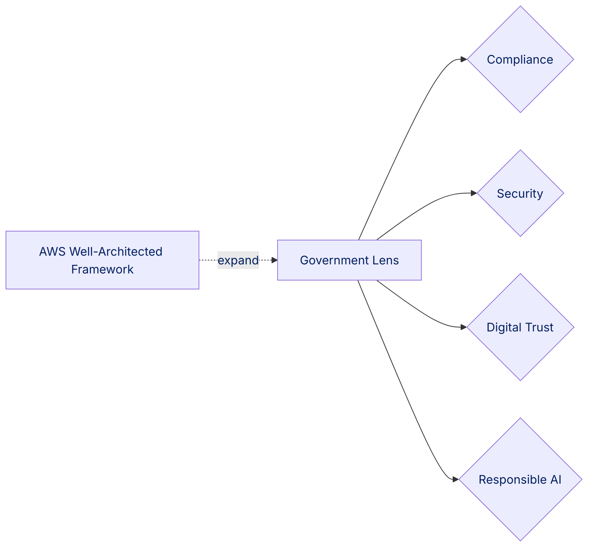
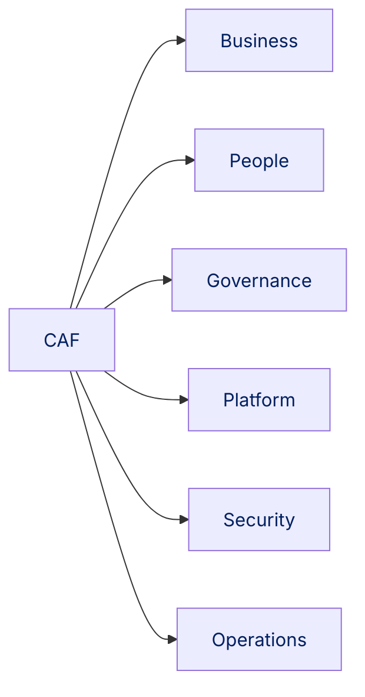
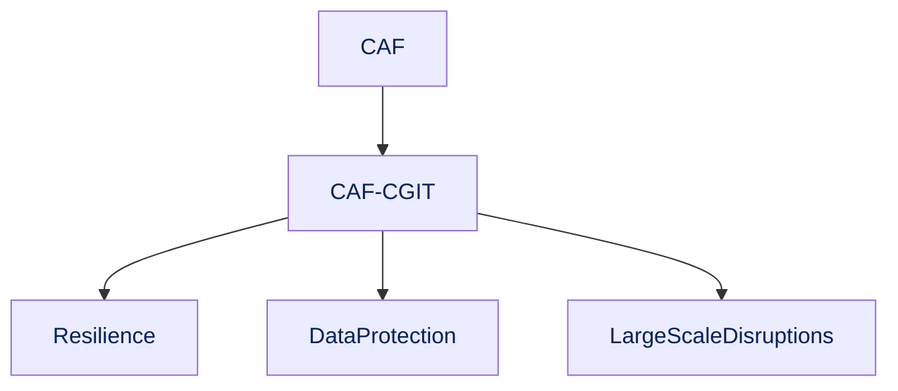
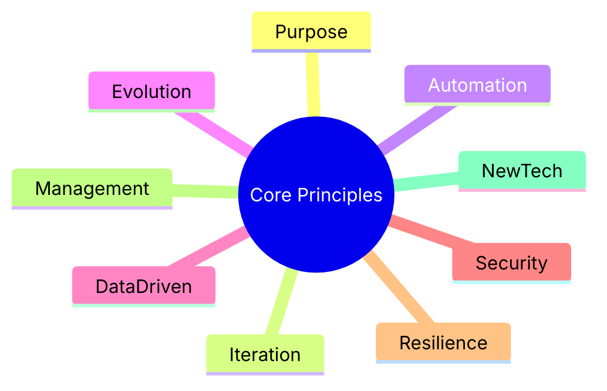

# Section 13: AWS Architecture & Systems Engineering Principles (Government)

Designing robust AWS solutions for government means following key frameworks and principles for security, resilience, efficiency, and compliance. Let’s distill the essentials.

## AWS Well-Architected Framework

Six pillars guide cloud architecture for reliable, efficient, secure, and cost-effective solutions.

| Pillar                 | Key Focus                                                                                    |
| ---------------------- | -------------------------------------------------------------------------------------------- |
| Operational Excellence | Automate operations, monitor performance, ensure continuous improvement.                     |
| Security               | Protect data/systems: classify data, least-privilege access, encryption, detective controls. |
| Reliability            | Design for fault tolerance: multi-AZ/Region, backups, clear RTO/RPO.                         |
| Performance Efficiency | Use scalable resources; monitor and optimize for dynamic demand.                             |
| Cost Optimization      | Align costs to needs; avoid waste via rightsizing, Reserved Instances, spend monitoring.     |
| Sustainability         | Minimize environmental impact, use efficient resources & managed services.                   |

**Pillars are the foundation of well-built cloud systems, each securing a vital service aspect.**

### Government Lens

AWS’s Government Lens adapts the Framework to public sector needs: compliance, classified info, digital trust, and responsible AI.

**Government Lens tailors AWS principles for public sector compliance and trust.**

---

## AWS Cloud Adoption Framework (CAF)

CAF guides cloud migration using six perspectives:

| Perspective | Role                                                            |
| ----------- | --------------------------------------------------------------- |
| Business    | Align cloud to mission goals/KPIs.                              |
| People      | Organize skill & change management.                             |
| Governance  | Policies, audit, risk management.                               |
| Platform    | Core infrastructure and dev practices (IaC, secure networking). |
| Security    | Protect workloads, identity, monitoring.                        |
| Operations  | Monitoring, incident response, improvement.                     |

**CAF perspectives provide the structure for organizational cloud success.**

### CAF for Continuity of Government IT (CAF-CGIT)

Extension for resilience, focusing on digital continuity and citizen data protection.

**CAF-CGIT provides extra safeguards for critical government IT.**

## Core Systems Engineering Principles for AWS in Government

- **Purpose-Driven Design:** Architect to mission and outcomes.
- **Frequent Iteration:** Use agile delivery; refine via feedback.
- **Automate:** Reduce manual steps (testing, deployment, compliance).
- **Evolve:** Build adaptable, modular systems.
- **Data-Informed Decisions:** Monitor, analyze, optimize continuously.
- **Security by Design:** Model threats and automate security from the start.
- **Resilience:** Plan for faults; multi-AZ/Region, backups, DR.
- **Technical Management:** Integrate stakeholders, legacy systems, compliance.
- **Tech Evaluation:** Cautiously adopt emerging tech (AI, Bedrock) in secure boundaries.

**Core principles ensure government cloud solutions are secure, resilient, and fit for purpose.**

By applying these frameworks, lenses, and principles, governments build AWS-powered solutions that are secure, efficient, and resilient—ready to meet citizen needs.
