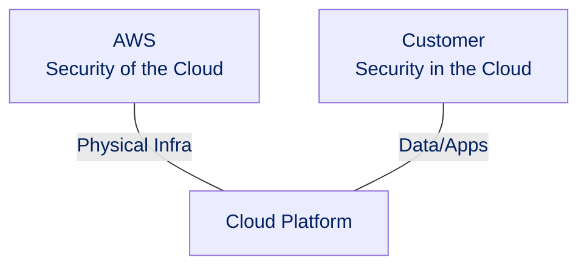
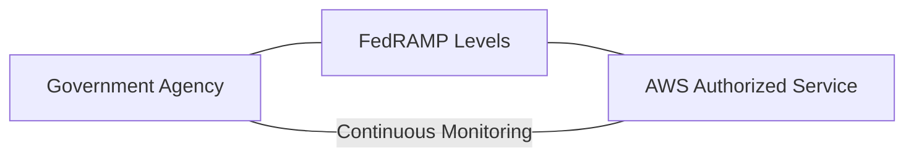
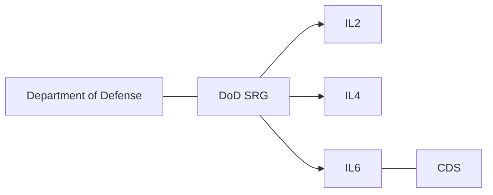
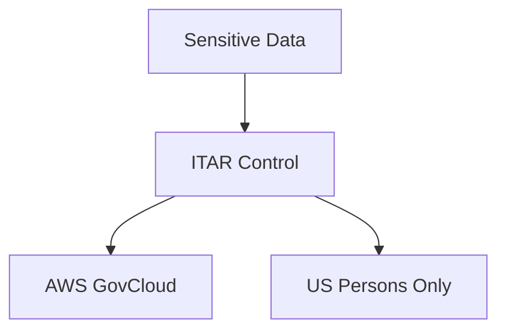
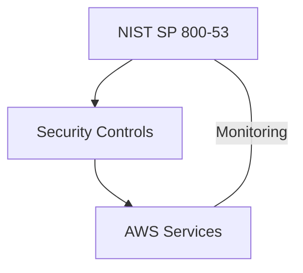
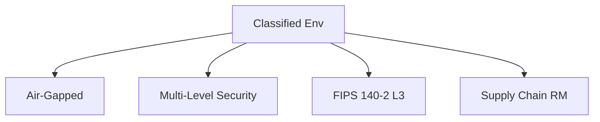
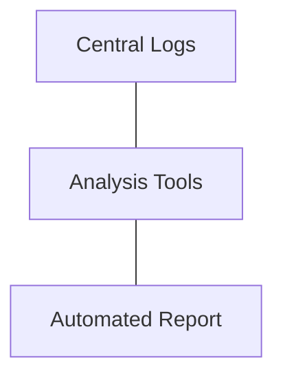
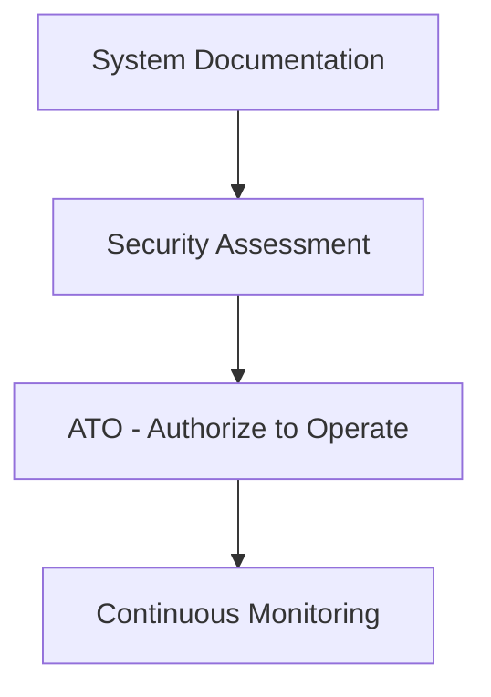
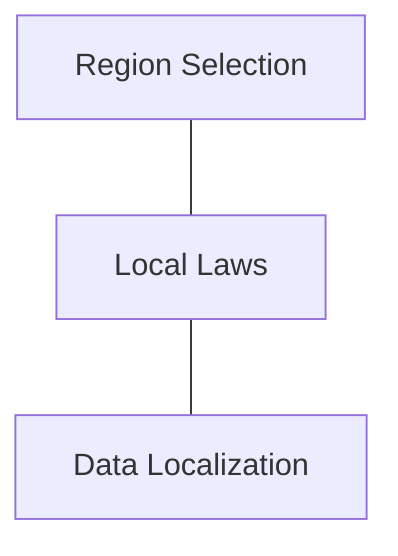
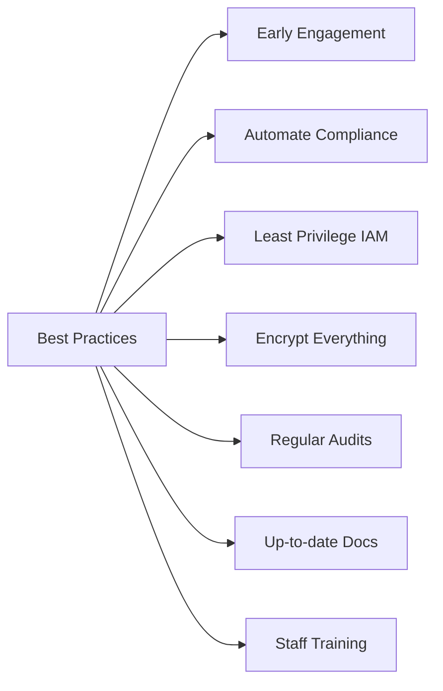

# Section 07: Compliance & Regulatory Adherence

## AWS Shared Responsibility Model

AWS secures the cloud infrastructure. Customers secure their data, apps, and configuration in AWS.

## Key Compliance Frameworks

### FedRAMP

Federal standard for cloud security assessment & authorization.

- Levels: Low, Moderate, High
- Requires: Continuous monitoring

### DoD SRG

DoD security requirements for cloud; Impact Levels IL2–IL6

- Accreditation process
- May require Cross-Domain Solutions (CDS)

### ITAR

Regulation for defense data. Focus on US data residency and access controls.

- Use AWS GovCloud
- Require encryption, audit trails

### NIST SP 800-53

Security control catalog used for US federal IT.

- Implement with AWS services (CloudTrail, Config, Security Hub)
- Requires continuous monitoring

## Classified Environments

- Air-gapped networks
- Multi-Level Security (MLS)
- FIPS 140-2 Level 3 cryptography
- Supply Chain Risk Management

## Audit Management & C&A

### Audit

- Centralized logging (S3 Object Lock)
- Automated reporting (Config, Hub)
- Log analysis tools (Athena, SIEM)

### Certification & Accreditation (C&A/ATO)

- Document architecture, controls
- Independent assessment
- Continuous monitoring required

## Data Residency & Sovereignty

- Choose correct AWS region
- Comply with local laws (e.g., GDPR)
- Architect for data localization

## Best Practices

- **Engage Early:** Plan compliance from the start
- **Automate:** Use AWS Config, Security Hub, etc.
- **Least Privilege:** Tight IAM controls
- **Encryption Everywhere:** Encrypt data at rest & in transit
- **Regular Audits:** Internal & external
- **Documentation:** Keep details up-to-date
- **Training:** Staff on compliance & security

---
