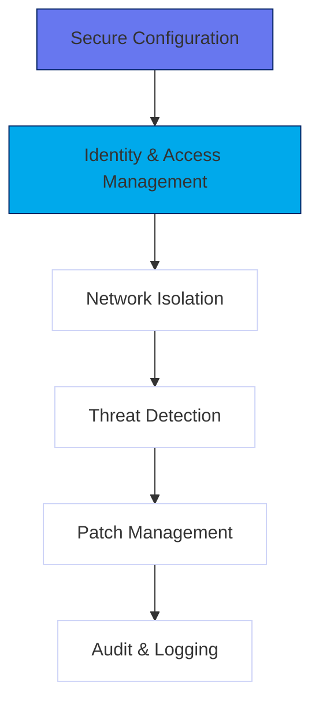
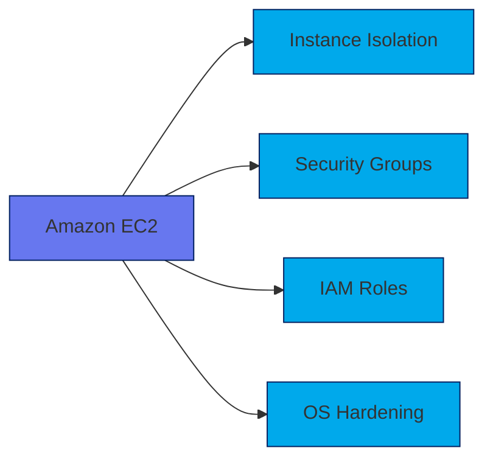
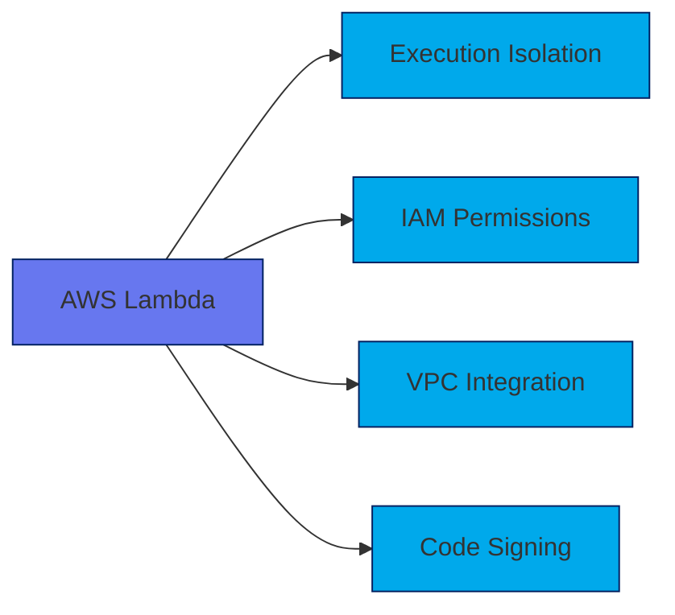
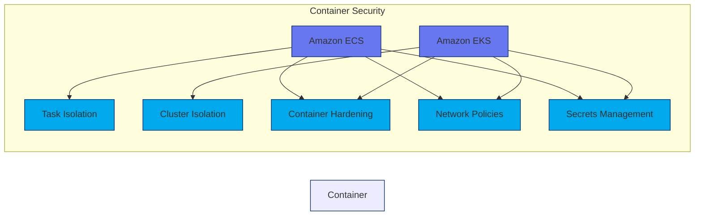
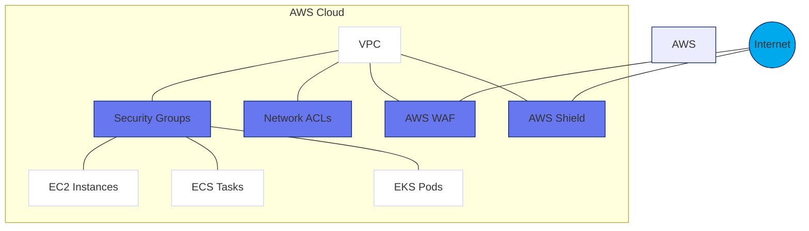
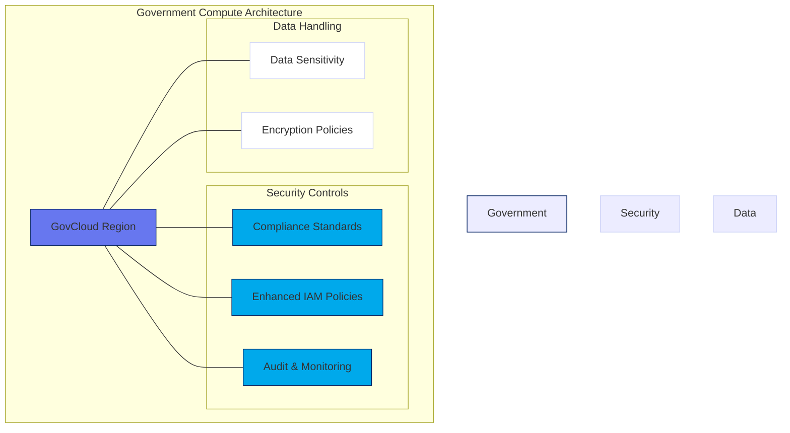
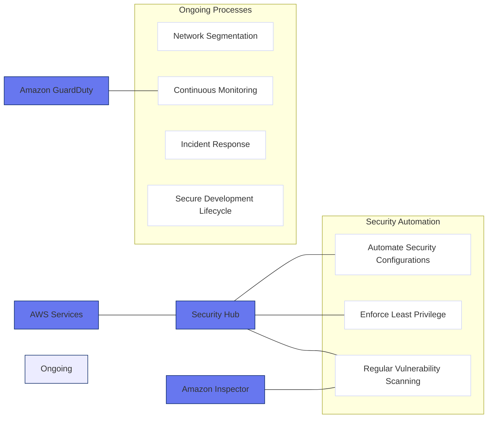

# Section 05: Compute Application Security

## Core Principles of Compute Security

Securing compute applications in AWS requires adherence to these fundamental principles:

- **Secure Configuration**: Harden operating systems and application environments
- **Identity and Access Management**: Enforce least privilege for users and services
- **Network Isolation**: Segment and protect network traffic
- **Threat Detection**: Monitor for suspicious activity and vulnerabilities
- **Patch Management**: Keep systems updated with the latest security patches
- **Audit and Logging**: Track and review all activities for forensic analysis

## AWS Compute Services and Security Features

### Amazon EC2 Security

Amazon Elastic Compute Cloud (EC2) security involves multiple layers:

- **Instance Isolation**: Hypervisor-level isolation between instances
- **Security Groups**: Stateful firewall for controlling inbound/outbound traffic
- **IAM Roles**: Temporary credentials for EC2 instances to access AWS services
- **OS Hardening**: Use of Amazon Machine Images (AMIs) with security baselines

### AWS Lambda Security

AWS Lambda provides serverless compute with built-in security features:

- **Execution Isolation**: Functions run in isolated environments
- **IAM Permissions**: Fine-grained control over function permissions
- **VPC Integration**: Run functions within a Virtual Private Cloud for network isolation
- **Code Signing**: Verify the integrity of function code using AWS Signer

### Amazon ECS and EKS Security

Containerized applications on Amazon Elastic Container Service (ECS) and Elastic Kubernetes Service (EKS) require specific security measures:

- **Task/Cluster Isolation**: Segregate workloads using IAM roles and namespaces
- **Container Hardening**: Use minimal base images and scan for vulnerabilities
- **Network Policies**: Enforce traffic rules within clusters
- **Secrets Management**: Securely store and access sensitive data with AWS Secrets Manager

## Network Security for Compute Applications

Protecting compute applications at the network level is critical:

- **VPC Configuration**: Use private subnets and restrict public access
- **Security Groups and NACLs**: Implement fine-grained access controls
- **AWS WAF**: Protect web applications from common exploits
- **AWS Shield**: Mitigate DDoS attacks with automated protection

## Government and Classified Environment Considerations

Government workloads on AWS compute services require additional safeguards:

- **Compliance Standards**: Adherence to FedRAMP, DoD SRG, and NIST SP 800-53
- **GovCloud Regions**: Deploy in isolated regions for sensitive workloads
- **Enhanced IAM Policies**: Restrict access based on classification levels
- **Audit and Monitoring**: Use CloudTrail and Config for continuous compliance checks
- **Data Sensitivity**: Enforce strict data handling and encryption policies

## Best Practices for Compute Application Security

- **Automate Security Configurations**: Use AWS Systems Manager for consistent hardening
- **Enforce Least Privilege**: Limit permissions with IAM policies and roles
- **Regular Vulnerability Scanning**: Use Amazon Inspector to identify risks
- **Implement Network Segmentation**: Isolate workloads using VPCs and subnets
- **Continuous Monitoring**: Leverage GuardDuty for threat detection
- **Incident Response Planning**: Prepare playbooks for security incidents
- **Secure Development Lifecycle**: Integrate security into CI/CD pipelines

