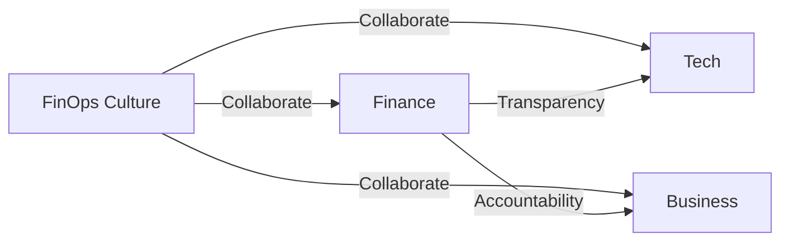
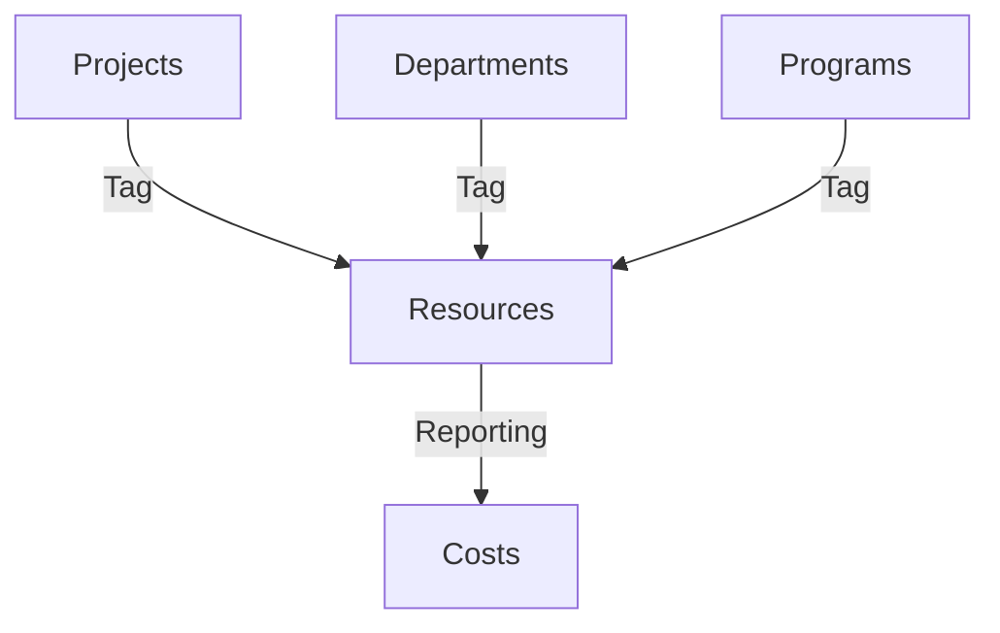
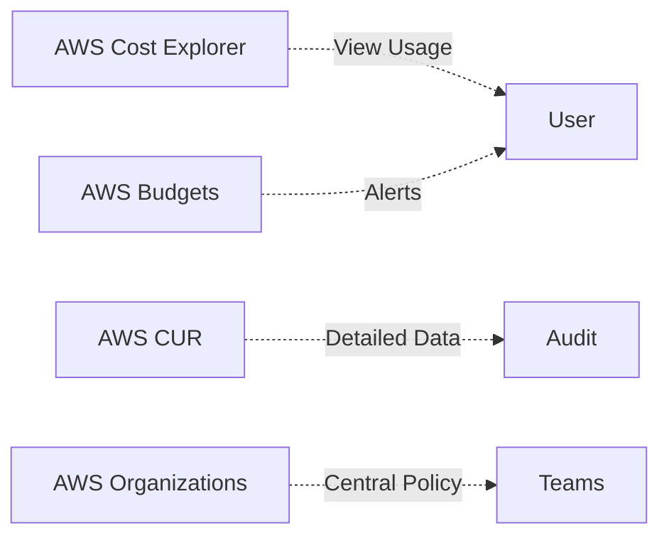
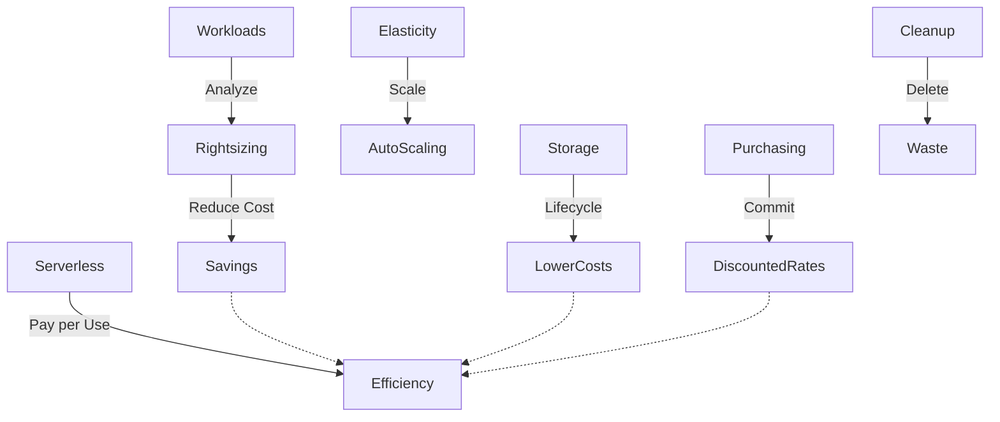
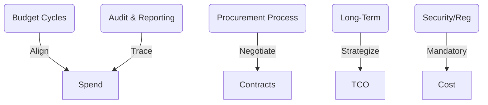

# Section 11: AWS Cost Management and Optimization

_AWS Cost Optimization is essential for government agencies to keep budgets on track, ensure transparency, and maximize efficiency._

## Cloud Financial Management (FinOps)

FinOps = Collaboration across finance, tech, and business for cloud cost accountability. Enables smart trade-offs (cost, performance, security) and ensures transparency.

## Cost Allocation & Tagging

Use tags to map resources to projects, departments, programs. Enables charge/showback and detailed auditing.

## AWS Cost Management Tools

- **Cost Explorer:** Visualize and analyze costs, detect anomalies.
- **Budgets:** Set limits, get alerts if exceeded.
- **CUR:** Detailed billing data for auditing.
- **Organizations:** Consolidate bills, set policies.

## Cost Optimization Strategies

- **Rightsizing:** Match resources to actual workload needs.
- **Elasticity:** Auto Scaling pays only for what's needed.
- **Purchasing Options:** Save with Reserved Instances/Savings Plans.
- **Storage Optimization:** Use S3 Lifecycle, Glacier, EBS tuning.
- **Serverless:** Pay only for what’s used.
- **Delete Unused Resources:** Automate cleanup.

## Government-Specific Considerations

- **Budget Cycles:** Align cloud spend to budget years.
- **Procurement:** Plan for long contract cycles.
- **Auditing:** Use CUR and tagging for traceability.
- **Strategic Planning:** Consider long-term TCO.
- **Compliance:** Security overheads must be budgeted.

**By following these principles and using the right AWS tools, government entities can control AWS costs efficiently, ensure compliance, and maintain transparency.**
