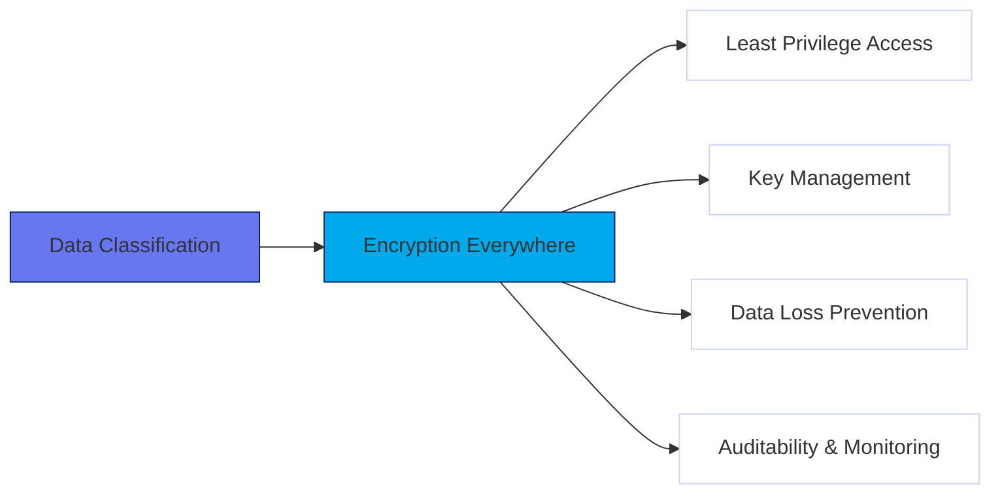
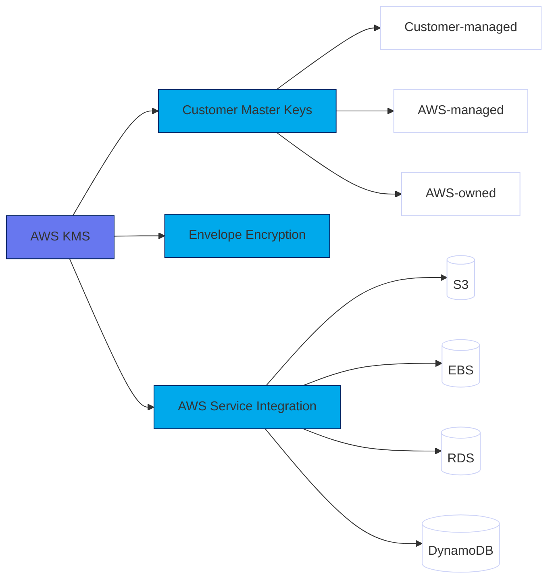
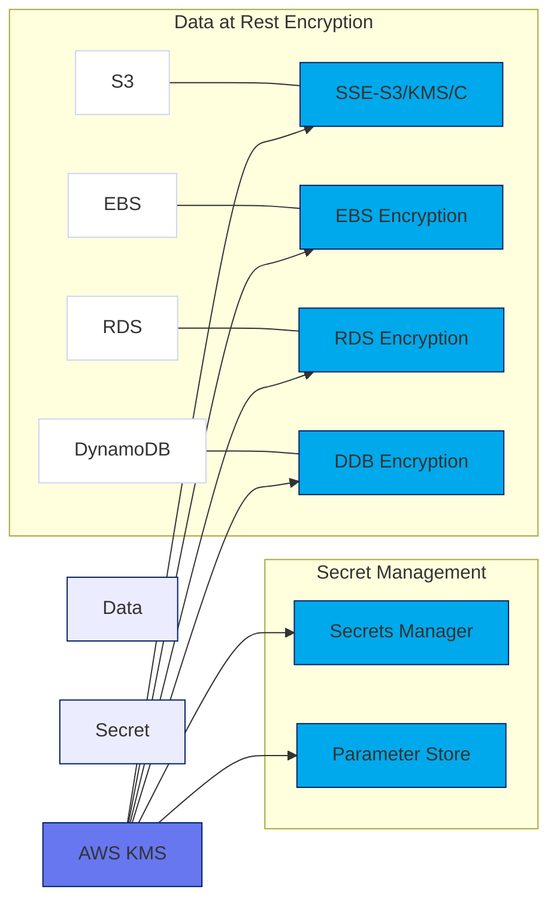
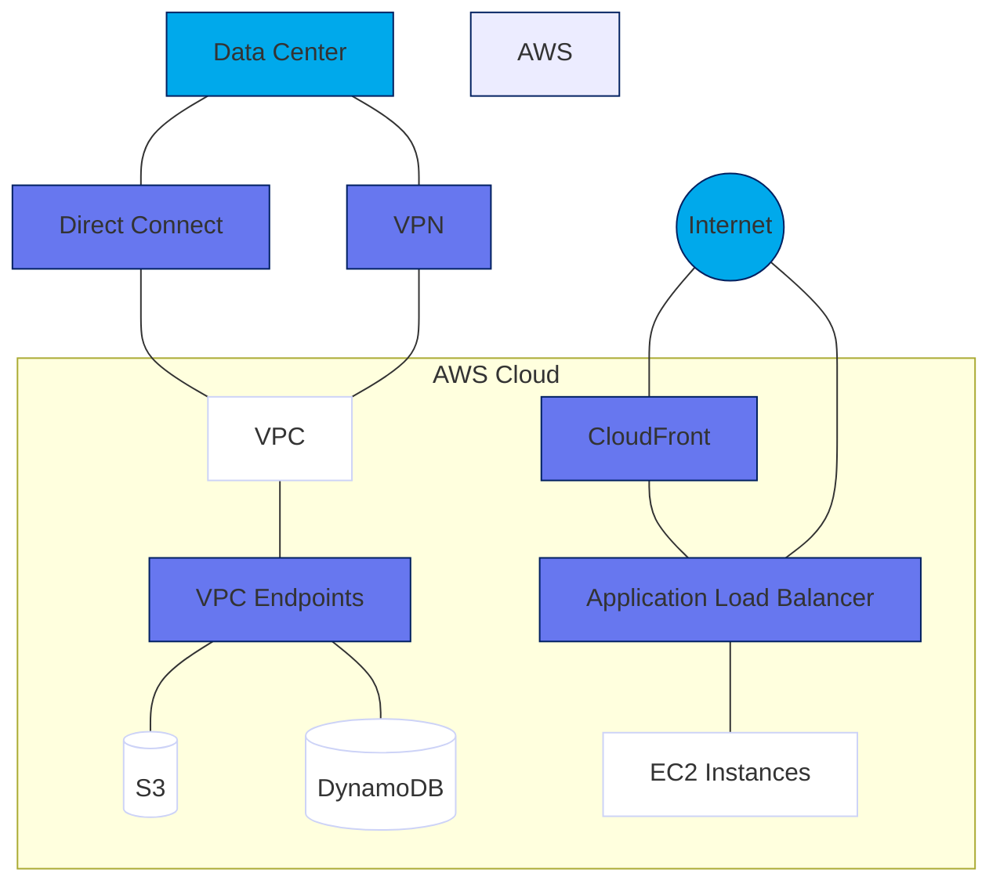
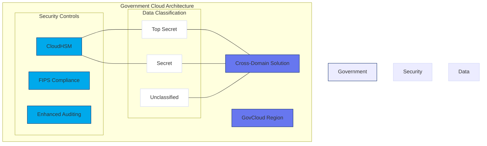
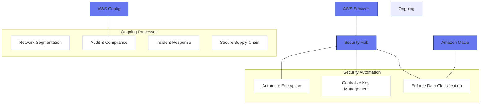

# Section 04: Data Protection and Encryption

## Core Principles of Data Protection

Effective data protection in AWS is built on these key principles:

- **Data Classification**: Categorize data based on sensitivity and regulatory requirements
- **Encryption Everywhere**: Protect data at rest, in transit, and in use
- **Least Privilege Access**: Strictly control access to encrypted data and keys
- **Key Management**: Securely manage the full lifecycle of encryption keys
- **Data Loss Prevention**: Prevent unauthorized data exfiltration
- **Auditability**: Log and monitor all data access activities

## AWS Services for Data Protection

### AWS Key Management Service (KMS)

KMS provides centralized control over encryption keys with:

- **Customer Master Keys (CMKs)**: Control who can use and manage keys
- **Envelope Encryption**: Efficiently protect data while securing the master key
- **Integration**: Works with most AWS services
- **Auditability**: All key usage logged to CloudTrail

### Data Encryption Options

AWS provides multiple encryption options for data at rest:

- **S3 Encryption**: SSE-S3 (AWS-managed), SSE-KMS (KMS keys), SSE-C (customer keys), client-side
- **EBS Encryption**: Volume encryption using KMS keys
- **RDS/DynamoDB Encryption**: Database encryption using KMS
- **Secrets Management**: Secrets Manager and Systems Manager Parameter Store

## Data Protection in Transit

Securing data as it moves through networks:

- **TLS/SSL**: Encrypt all API communications
- **VPC Endpoints**: Private connectivity to AWS services
- **Direct Connect/VPN**: Secure hybrid connectivity
- **ALB/CloudFront**: TLS termination and re-encryption

## Government and Classified Environment Considerations

Additional requirements for government workloads:

- **Compliance**: FedRAMP, DoD SRG, NIST SP 800-53, ITAR
- **Data Residency**: Use appropriate AWS regions (e.g., GovCloud)
- **Enhanced Key Management**: AWS CloudHSM for FIPS 140-2 Level 3 compliance
- **Cross-Domain Solutions**: Securely transfer data between classification levels
- **Comprehensive Auditing**: CloudTrail, Config, VPC Flow Logs

## Best Practices for Government Architectures

- **Automate Encryption**: Default encryption for all data stores
- **Centralize Key Management**: Consistent KMS strategy
- **Enforce Data Classification**: Use Macie for continuous monitoring
- **Segment Networks**: Limit blast radius with network controls
- **Regular Compliance Checks**: Use Config and Security Hub
- **Incident Response Planning**: Prepare for data breaches and key compromise
- **Secure Supply Chain**: Ensure third-party components meet security standards

