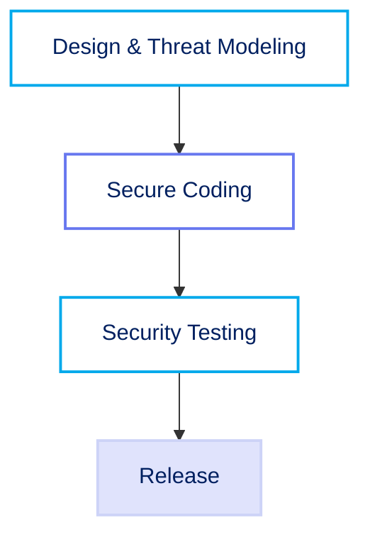
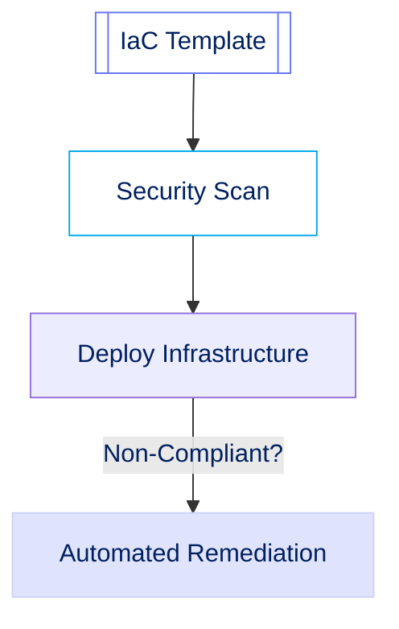
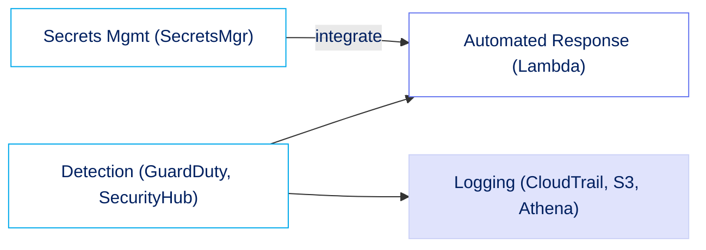
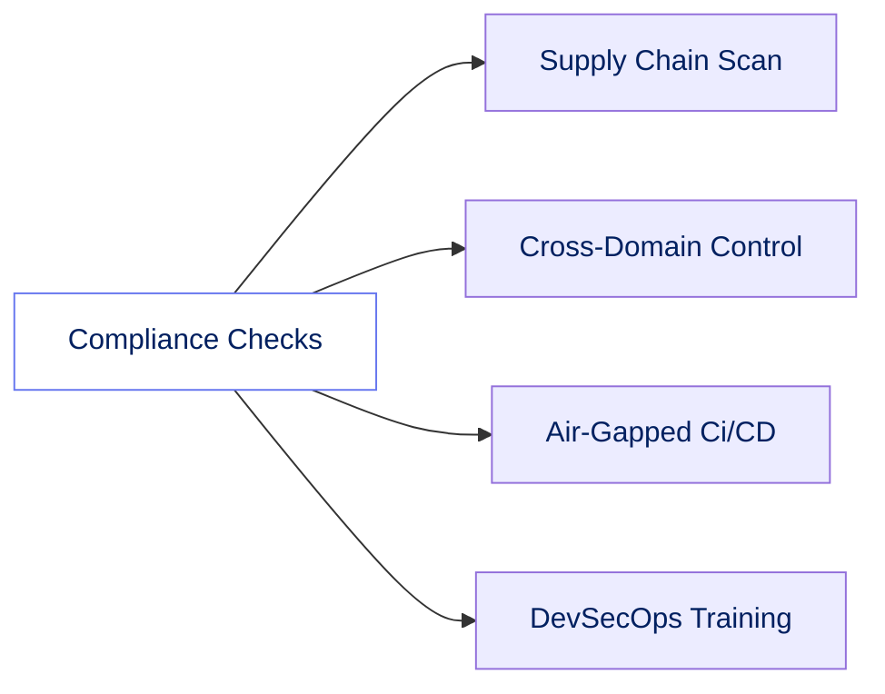

# Section 10: AWS DevSecOps & Automation

DevSecOps integrates security at every phase of the software development lifecycle (SDLC). Automation enables fast, repeatable, and secure operations—vital for protecting sensitive systems in government environments.

## Secure Software Development Lifecycle (SSDLC)

Security activities are embedded throughout SDLC, ensuring compliance and risk reduction.

| **Phase**             | **Description**                                                      |
| --------------------- | -------------------------------------------------------------------- |
| Design & Threat Model | Identify risks early (STRIDE, DREAD). Plan security in architecture. |
| Secure Coding         | Adhere to standards (OWASP, CWE) and use SAST tools.                 |
| Security Testing      | Employ DAST, SCA, and penetration testing.                           |

## CI/CD with Security Gates

Automated pipelines enforce security at every deployment stage.

| **Gate**           | **Description**                                             |
| ------------------ | ----------------------------------------------------------- |
| SAST               | Code scanned on commit.                                     |
| SCA                | Dependencies checked for vulnerabilities.                   |
| Container Scans    | Images checked before registry push (Amazon ECR).           |
| Policy as Code     | Security policies enforced automatically (AWS Config, SCP). |
| Automated Rollback | Rapid revert to secure state if issues detected.            |

```mermaid
%%{init: {"themeVariables": {"bgColor": "#e0e3fc", "textColor":"#002060", "primaryColor":"#6777ef", "secondaryColor":"#00a9eb", "cardBackground":"#ffffff", "borderColor":"#cdd3f7"}}}%%
flowchart LR
    Code["<b>Code</b>"]
    Scan1["SAST"]
    Scan2["SCA"]
    Scan3["Container Scan"]
    Policy["Policy as Code"]
    Deploy["Deploy"]
    Rollback["Rollback (if needed)"]
    Code --> Scan1 --> Scan2 --> Scan3 --> Policy --> Deploy
    Deploy -- Issue detected --> Rollback
    style Code fill:#ffffff,stroke:#00a9eb,stroke-width:2px
    style Policy fill:#ffffff,stroke:#6777ef,stroke-width:2px
```

## Infrastructure as Code (IaC) & Security

IaC governs infrastructure with code—versioned, tested, repeatable, and secure.

| **IaC Controls**     | **Description**                                         |
| -------------------- | ------------------------------------------------------- |
| Least Privilege      | Restrictive IAM roles/policies.                         |
| Encryption Default   | Data encrypted (at rest/in transit).                    |
| Network Segmentation | Strict security groups, ACLs.                           |
| Logging/Monitoring   | Use CloudTrail, CloudWatch, AWS Config.                 |
| Security Scanning    | Templates scanned for misconfigurations before release. |
| Remediation          | Automatic fixes or alerts for non-compliance.           |

## Security Automation & Orchestration

Automation enables fast response, monitoring, and secrets protection.

| **Automation Area** | **Description**                                     |
| ------------------- | --------------------------------------------------- |
| Incident Response   | Automated workflows for alerts (GuardDuty, Lambda). |
| Central Logging     | Centralized log aggregation (S3, Athena, SIEM).     |
| Secrets Management  | Stored in AWS Secrets Manager; auto-rotation.       |

## Govt/Classified Considerations

| **Priority**     | **Description**                                  |
| ---------------- | ------------------------------------------------ |
| Compliance       | Map controls to frameworks (FedRAMP, SRG, NIST). |
| Supply Chain     | Integrity scanning for all code/components.      |
| Cross-Domain     | Controls for data/code flow between domains.     |
| Air-Gapped       | Offline CI/CD, strict manual reviews.            |
| Training/Culture | Ongoing DevSecOps/security education.            |

**Summary**:  
DevSecOps with automation in AWS delivers fast, secure, and compliant deployments for sensitive government systems. Security must be coded into every phase—from initial design and IaC, through CI/CD, to incident response and ongoing training.
