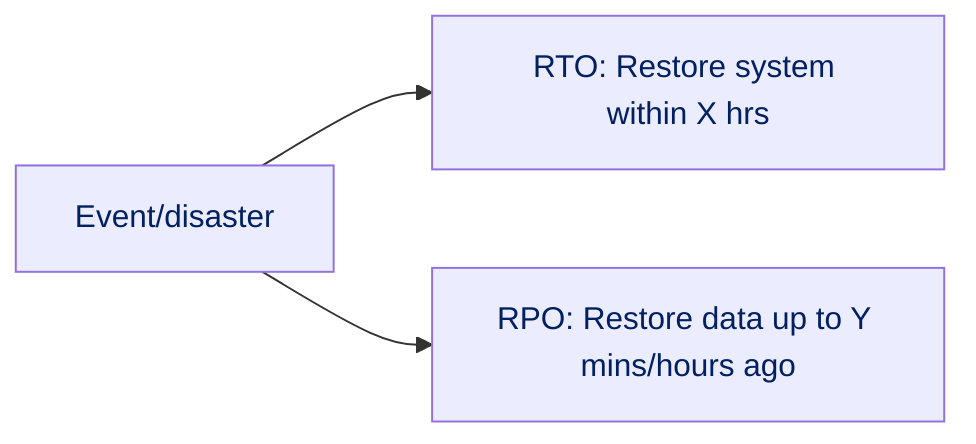
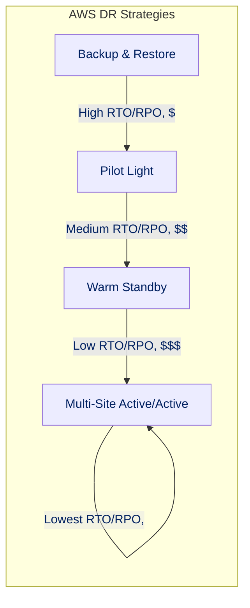
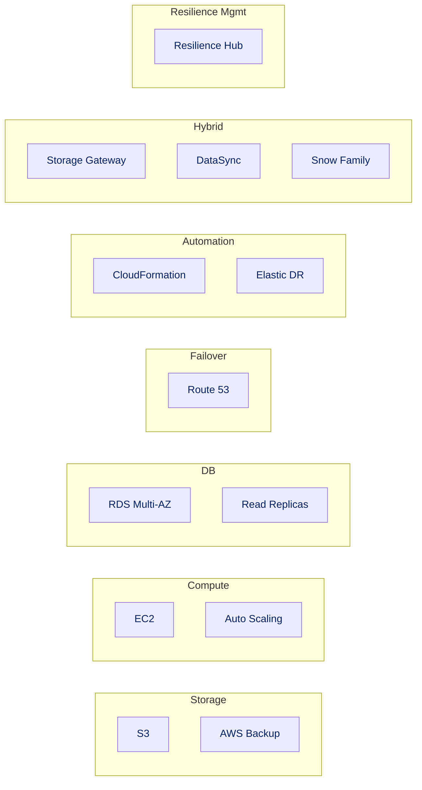
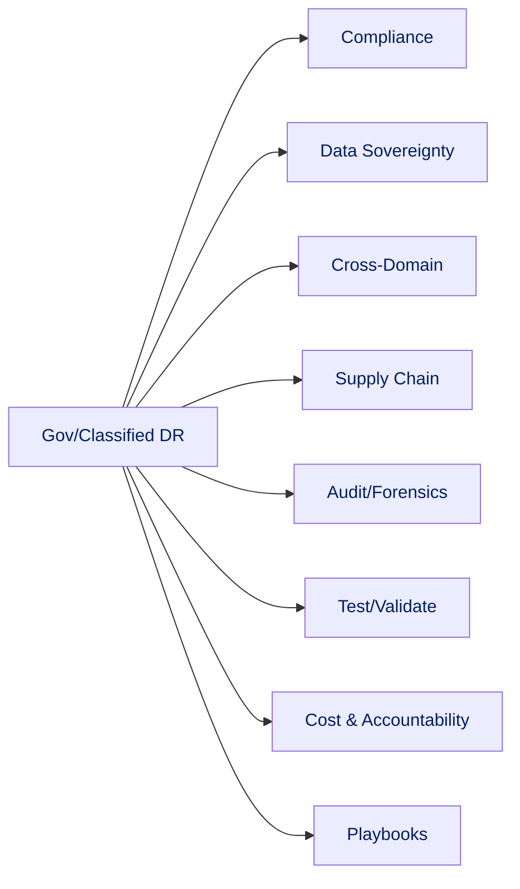

# Section 09: Disaster Recovery & Business Continuity (BCP)

Ensuring resilience against outages is critical, especially for government and classified environments. AWS offers scalable strategies balancing recovery speed (RTO) and data loss (RPO).

## Recovery Objectives

- **RTO (Recovery Time Objective):** Max downtime after disaster.
- **RPO (Recovery Point Objective):** Max data loss measured in time.

## AWS DR Strategies

| Strategy          | RTO/RPO | Cost | Description                           |
| ----------------- | ------- | ---- | ------------------------------------- |
| Backup/Restore    | High    | $    | Regular backups, restore as needed    |
| Pilot Light       | Medium  | $$   | Minimal running infra, rapid scale up |
| Warm Standby      | Low     | $$$  | Scaled-down, partially active copy    |
| Multi-Site/Active | Lowest  | $$$$ | Fully redundant, dual active sites    |

## Core AWS Services

- **Storage:** S3, AWS Backup
- **Compute:** EC2, Auto Scaling
- **Database:** RDS Multi-AZ, Read Replicas
- **Failover:** Route 53
- **Automation:** CloudFormation, DRS
- **Hybrid/Transfer:** Storage Gateway, DataSync, Snow Family
- **Resilience Management:** Resilience Hub

## Key Considerations: Government/Classified

- **Compliance:** Meets FedRAMP, DoD SRG, ITAR, NIST.
- **Data Sovereignty:** Use AWS GovCloud, control boundaries.
- **Cross-Domain Solutions:** Secure data flow between networks.
- **Supply Chain Risk:** Assess hardware, software integrity.
- **Audit & Forensics:** Log all recovery actions.
- **Testing:** Frequent, scenario-based drills.
- **Cost & Accountability:** Balance security, budget, transparency.
- **BCP Playbooks:** Roles, contacts, recovery steps clearly documented.

By combining these AWS tools and strategies, agencies achieve resilient, compliant, and cost-effective disaster recovery and business continuity.
