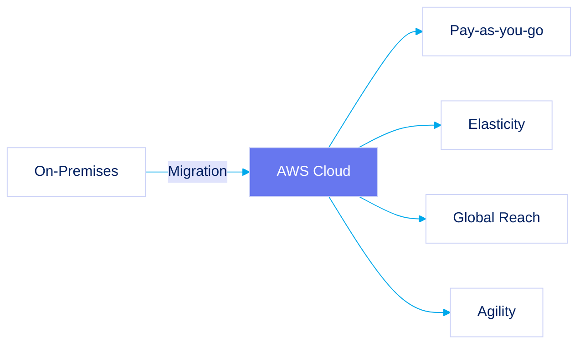
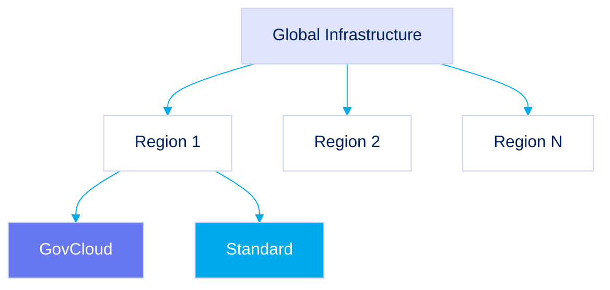
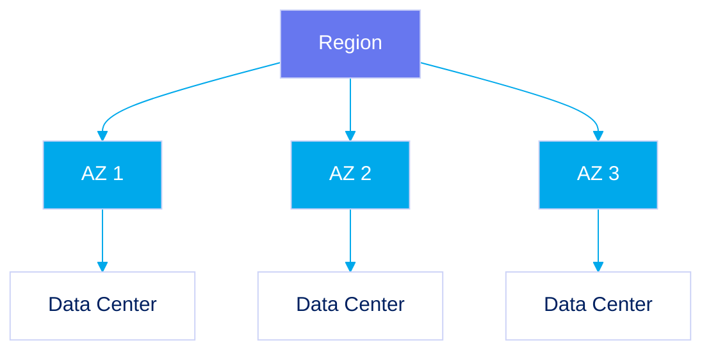
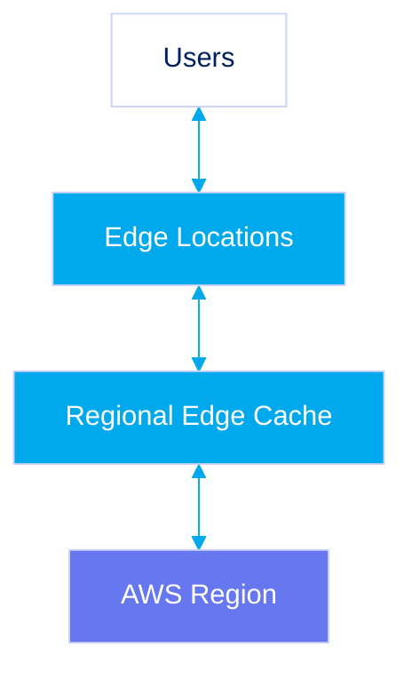
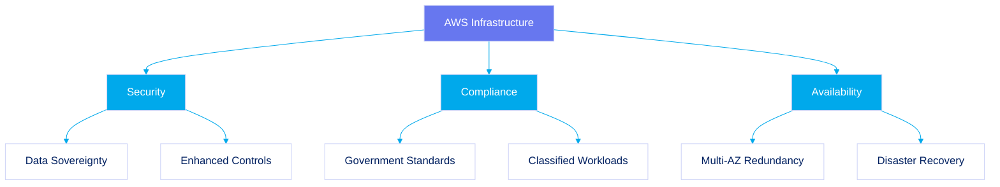

# Section 01: Introduction

## Introduction to AWS Cloud Computing

AWS provides a comprehensive cloud platform with 200+ services globally. Cloud computing delivers IT resources on-demand via the internet with pay-as-you-go pricing, offering:

- Increased agility and elasticity
- Cost optimization
- Global reach
- Rapid deployment capabilities

For government entities, these benefits enable faster innovation, better response to citizen needs, and improved operational continuity.

## AWS Global Infrastructure

AWS's global infrastructure is designed for high availability, fault tolerance, and disaster recovery through Regions, Availability Zones (AZs), and Edge Locations.

### AWS Regions

Regions are geographic areas containing multiple, isolated Availability Zones. Each Region operates independently from others, ensuring fault tolerance.

Government entities select Regions based on:

- Data residency requirements
- Regulatory compliance needs
- Proximity to users/data centers

Specialized government Regions (like AWS GovCloud) provide enhanced security for classified workloads.

### AWS Availability Zones (AZs)

Each Region contains multiple physically separate and isolated Availability Zones. AZs are:

- Connected via high-bandwidth, low-latency networks
- Located in separate facilities with redundant power and networking
- Designed to enable high availability and fault tolerance

For government systems, multi-AZ deployments ensure continuous operation of mission-critical applications, even during localized outages.

### AWS Edge Locations and Regional Edge Caches

Edge network components complement Regions and AZs:

- Edge Locations: Endpoints closer to end-users for services like CloudFront
  ![[Pasted image 20250812010631.jpg]]
- Regional Edge Caches: Larger caches between Edge Locations and origin Regions

Government applications benefit from reduced latency and enhanced content delivery resilience.

## Strategic Importance for Government and Classified Environments

AWS architecture directly supports government requirements through:

- Regional isolation ensuring data sovereignty
- Multi-AZ design providing high availability for critical operations
- Edge network enabling secure, low-latency access for distributed agencies
- Specialized government clouds for classified workloads with enhanced security

## Conclusion

Understanding AWS's global infrastructure is essential for architects working with government entities. Proper implementation of Regions, AZs, and Edge Locations ensures solutions meet stringent compliance, security, and operational requirements while maximizing cloud benefits.

## Resources

[Regions and Availability Zones](https://aws.amazon.com/about-aws/global-infrastructure/regions_az/)
