# Section 14: Government-Specific AWS Project Aspects

Working with AWS in government and classified environments introduces distinct challenges. These projects are characterized by stringent regulatory frameworks, unique procurement processes, and national security imperatives. Understanding these nuances is critical for any architect.

## Regulatory Frameworks and Compliance

Government projects demand strict adherence to regulatory frameworks for security and data handling.

### FedRAMP and DoD SRG

Mandatory U.S. government-wide program for cloud security. Requires specific authorization levels (Moderate, High). DoD SRG extends FedRAMP with Impact Levels (IL2-IL6) for data sensitivity. AWS GovCloud (US) is crucial for meeting these ILs.

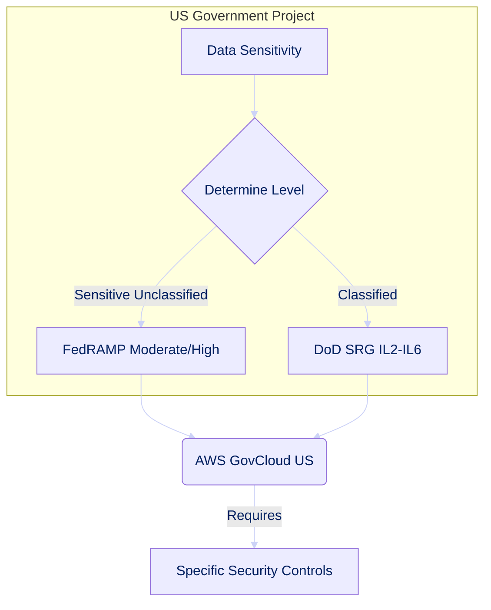

### ITAR and NIST SP 800-53

ITAR mandates data residency within U.S. borders and U.S. person access for defense-related items, supported by AWS GovCloud. NIST SP 800-53 provides a comprehensive catalog of security controls for federal systems, requiring rigorous implementation and auditing.

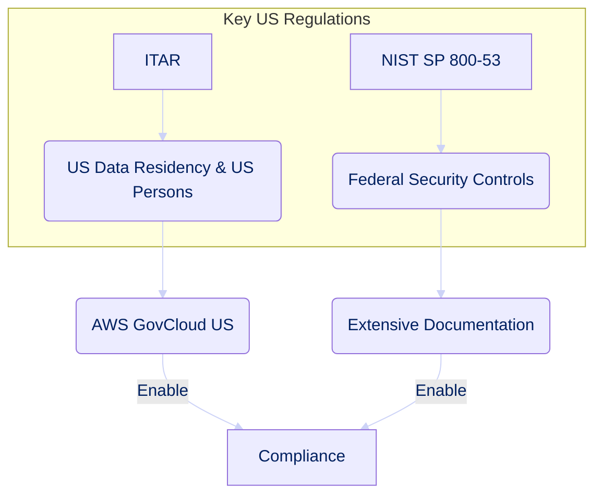

### Israeli Regulations and Data Sovereignty

Israeli government projects must comply with local regulations (e.g., National Cyber Directorate, Shin Bet, Privacy Protection Law), often enforcing strict data residency and sovereignty within Israel's borders. The Nimbus project highlights this strategic focus.

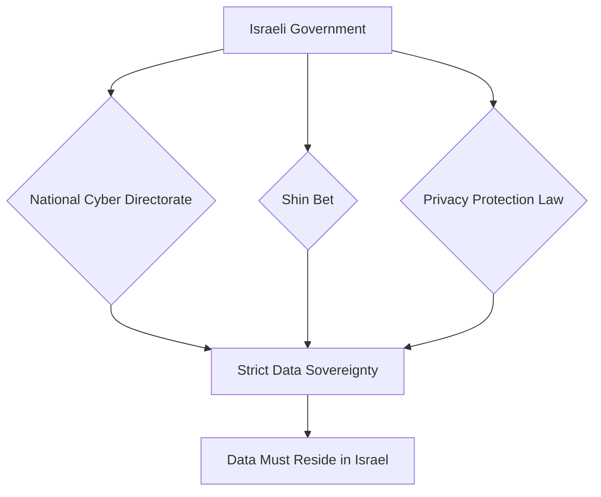

## Procurement Processes and Budget Cycles

Government procurement is lengthy and complex, influencing project timelines and design.

### Long-Term Strategic Planning

Projects require multi-year strategic planning, demanding adaptable architectures that account for evolving requirements, long-term operational costs, and integration with legacy systems over decades.

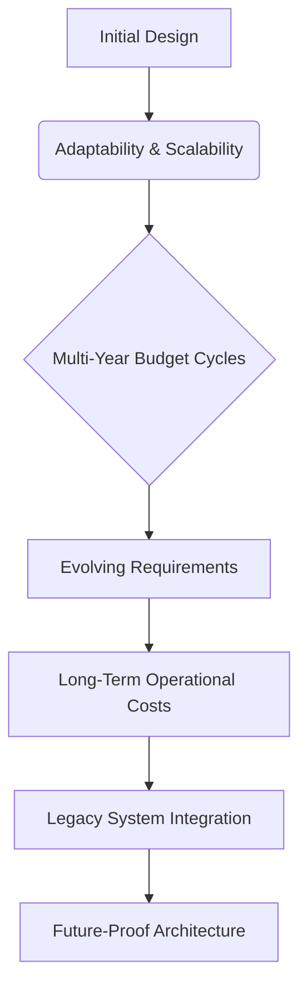

### Budget Constraints and Public Accountability

Public funds enforce strict budget constraints and high accountability. Architectures must prioritize cost-effectiveness, demonstrate clear ROI through optimization and detailed forecasting, and ensure transparent, defensible decisions.

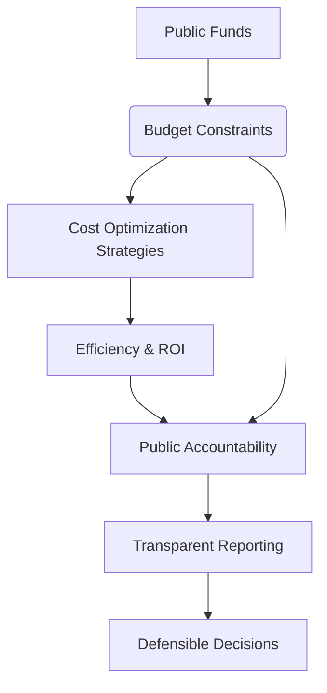

## Classified Environments and Cross-Domain Solutions

Operating in classified environments introduces the highest security and operational complexities.

### Air-Gapped Environments and Multi-Level Security

Highly sensitive projects may operate in air-gapped environments, using AWS Outposts or Snow Family for on-premises AWS extensions. Multi-Level Security (MLS) architectures manage different classification levels within a single system, demanding stringent access controls and data separation.

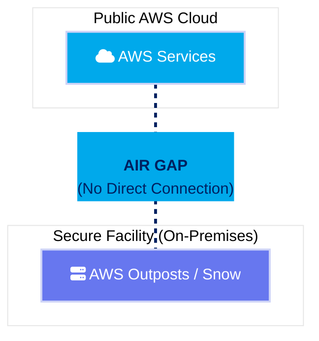

### FIPS 140-2 Level 3 and Nitro Enclaves

FIPS 140-2 Level 3 certification is often mandatory for cryptographic modules (e.g., AWS KMS, CloudHSM). AWS Nitro Enclaves provide isolated compute environments within EC2, enhancing security for highly sensitive data by reducing the attack surface.

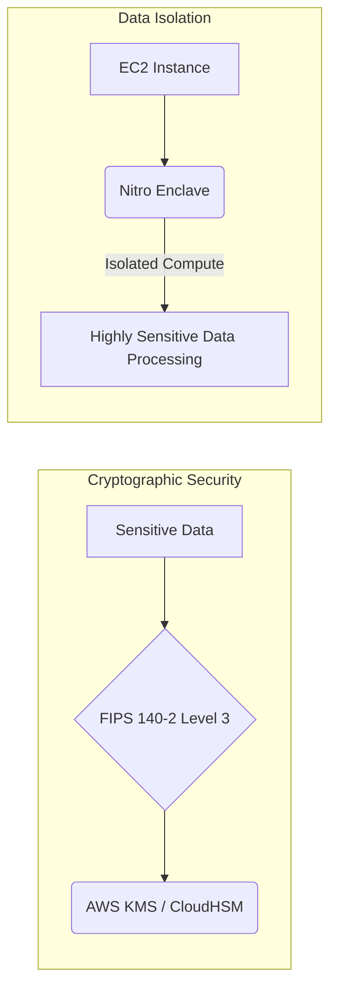

## Audit Management and Authorization to Operate (ATO)

Achieving and maintaining an Authorization to Operate (ATO) is a crucial milestone for government systems.

### Certification and Accreditation (C&A) Process

The C&A process involves a formal evaluation of a system's security posture and risk management, leading to an ATO. Architects must document security controls and support the rigorous assessment.

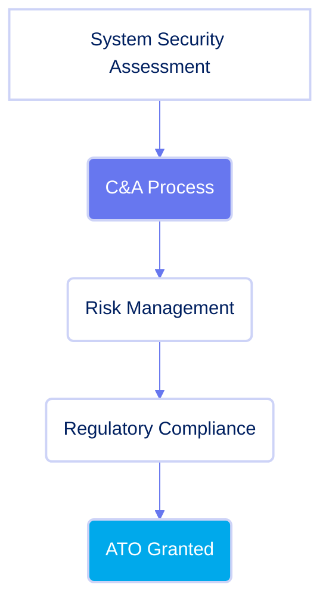

### Continuous Monitoring and Auditability

Post-ATO, continuous monitoring ensures ongoing compliance. AWS services like CloudTrail, Config, Security Hub, and GuardDuty are vital for comprehensive audit trails, enabling rapid anomaly detection and incident investigation.

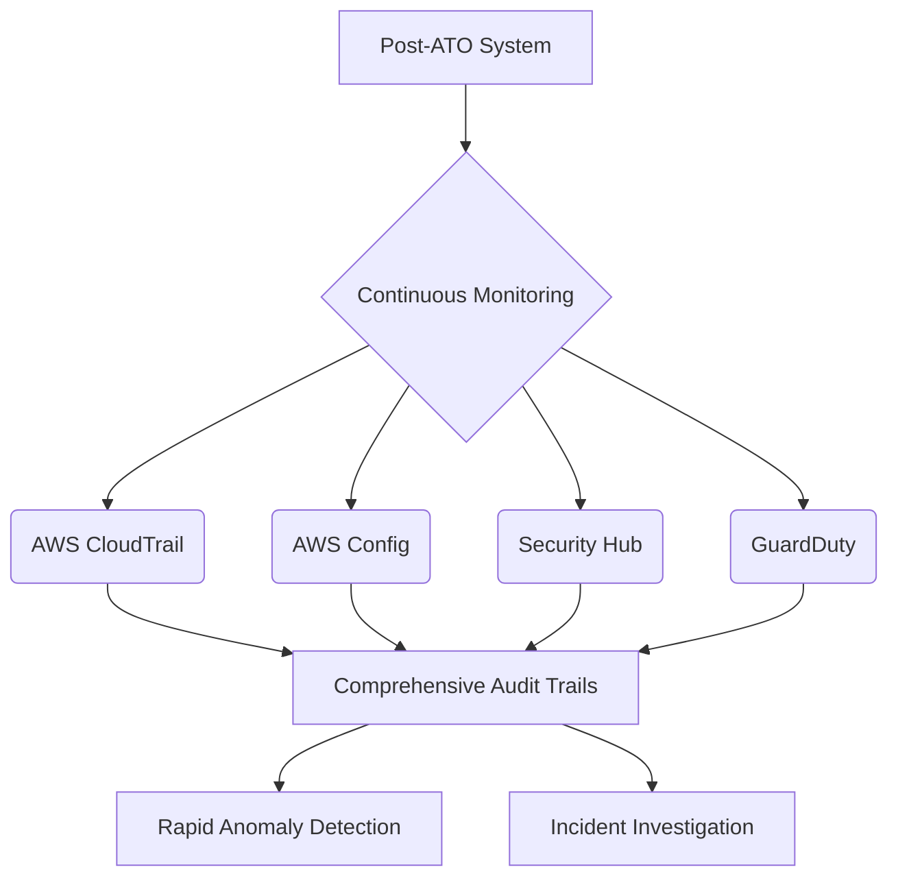

## Supply Chain Risk Management (SCRM)

Government projects are highly sensitive to supply chain risks, requiring robust management.

### Vendor Assessment and Trust

Assess the security posture and trustworthiness of all vendors and third-party components integrated into the AWS solution for a holistic risk evaluation.

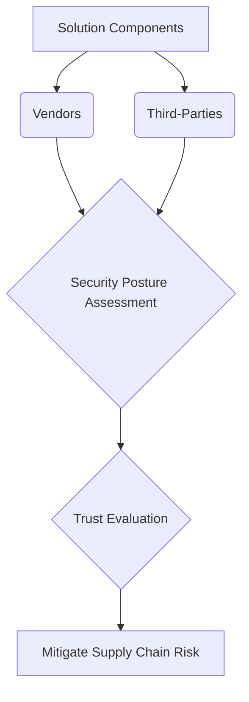

### Software and Hardware Assurance

Ensure the integrity and authenticity of all software and hardware components through provenance verification, secure boot, and services like AWS Certificate Manager. Designs must minimize unverified components and include compromise detection.

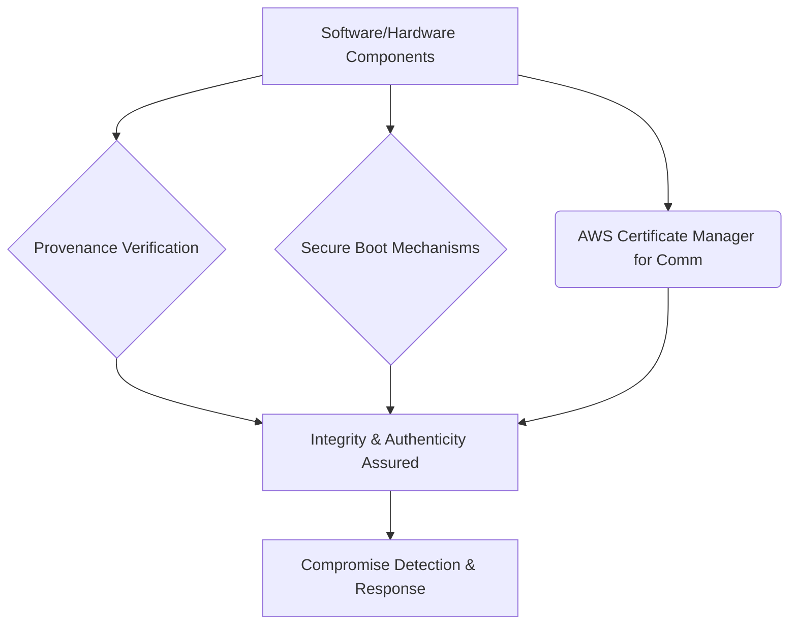
