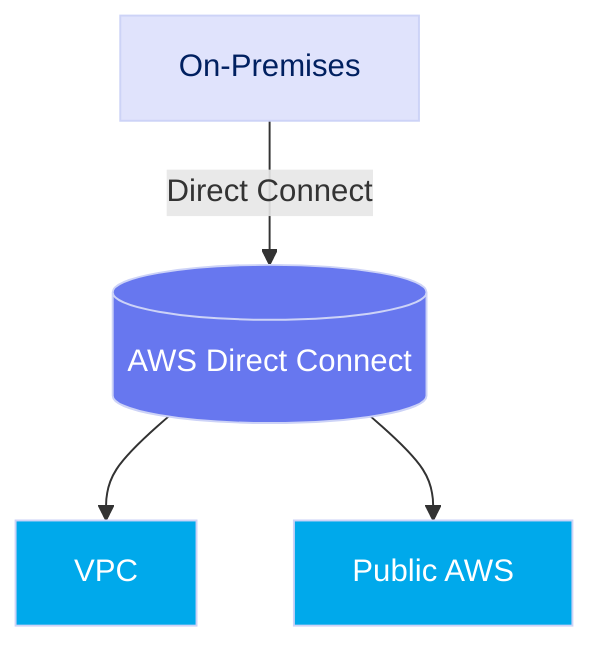
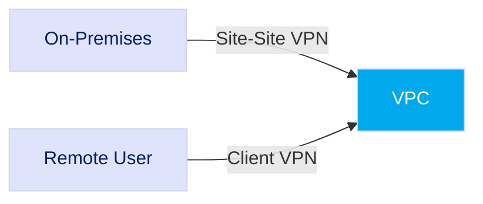
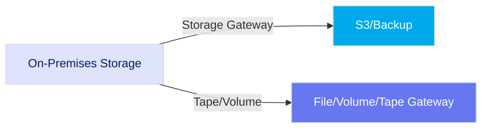
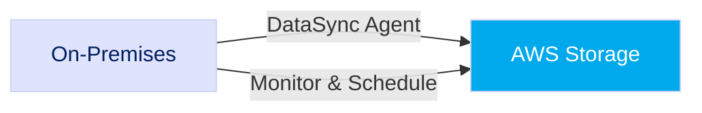
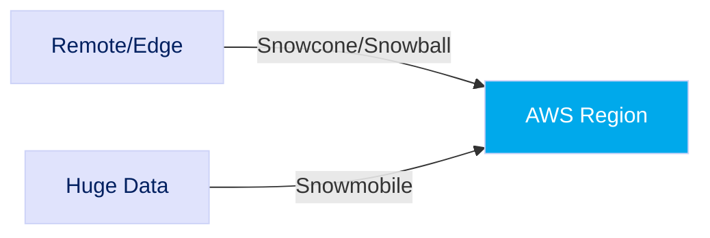
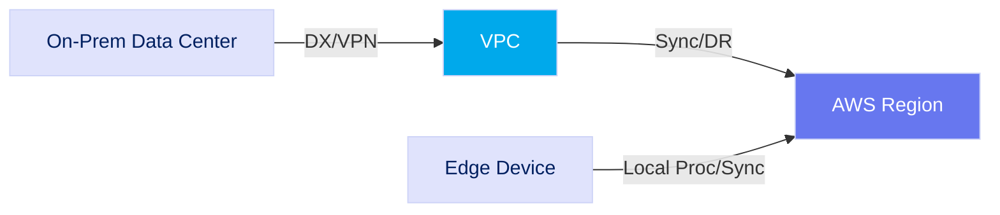
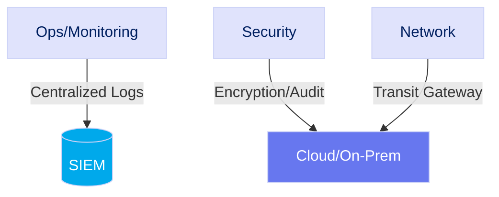

# Section 08: AWS Hybrid Cloud & Connectivity

## Overview

Hybrid cloud combines on-premises systems with public cloud, enabling secure, scalable, and cost-efficient solutions—crucial for government and classified environments.

## AWS Direct Connect

Dedicated, private network connection from your site to AWS.

**Benefits:**

- Lower cost vs. internet
- Predictable, high bandwidth (1–100 Gbps)
- Secure (no public internet exposure)

**Gov/Classified:**

- Meets data residency/security needs
- Use redundancy for availability

## AWS VPN

Encrypted tunnels connect on-premises networks/users to AWS—over the internet.

**Types:**

- Site-to-Site: Network-to-VPC
- Client VPN: Remote users-to-VPC

**Benefits:**

- Secure (IPsec, FIPS 140-2)
- Flexible & cost-effective

**Gov/Classified:**

- Use as backup or for small offices

## AWS Storage Gateway

Bridges on-premises storage with AWS.

**Types:**

- File Gateway: S3 via NFS/SMB
- Volume Gateway: iSCSI (cache/stored)
- Tape Gateway: VTL to S3

**Benefits:**

- Hybrid storage, backup & DR
- Compliant long-term archive

**Gov/Classified:**

- Secure/immutable archival
- Integrate with existing backups

## AWS DataSync

Automates secure, high-speed data transfers between on-prem and AWS storage.

**Benefits:**

- Fast, parallel & automated
- Scheduled tasks
- Data integrity verified

**Gov/Classified:**

- Large-scale migrations
- Supports GovCloud & compliance tracking

## AWS Snow Family

Physical devices for edge processing & offline data transfer.

**Types:**

- Snowcone: Small edge device
- Snowball Edge: Compute/storage
- Snowmobile: Massive-scale (100PB)

**Benefits:**

- Offline transfer
- Edge compute
- Physical security

**Gov/Classified:**

- For disconnected or secure locations
- Meets chain-of-custody & tamper requirements

## Hybrid Architecture Patterns

- **Data Center Extension**: Connect on-premises to VPC (Direct Connect/VPN)
- **Disaster Recovery**: Replicate data/apps to AWS
- **Bursting**: Scale compute with cloud
- **Edge Compute**: Use Snow/Outposts for local + AWS sync

## Gov/Classified: Challenges & Best Practices

- **Security/Compliance**: FedRAMP/NIST/DoD SRG
- **Data Residency**: Geographically bound data
- **Performance**: Latency/Bandwidth management
- **Ops**: Unify monitoring & resource management
- **Interoperability**: Seamless data/app flow

**Best Practices:**

- Transit Gateway for routing
- IAM integration
- Centralized logging (CloudWatch/CloudTrail+SIEM)
- IaC for automation
- End-to-end encryption
- Frequent security audits
- Use Cross-Domain Solutions

