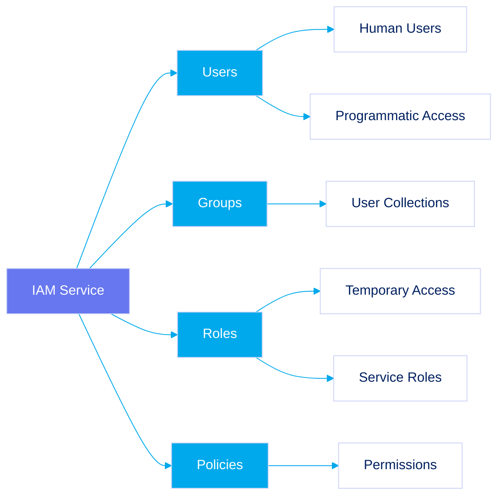
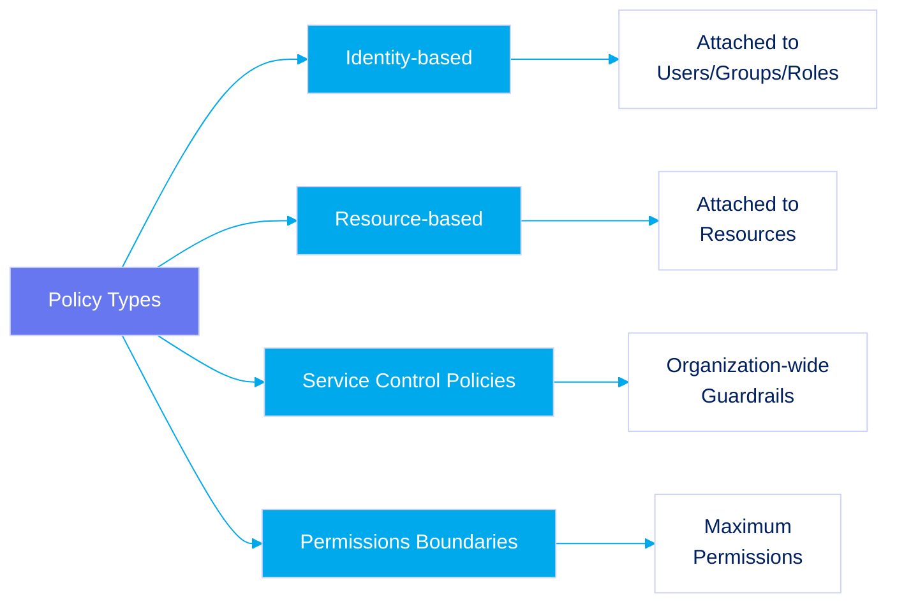
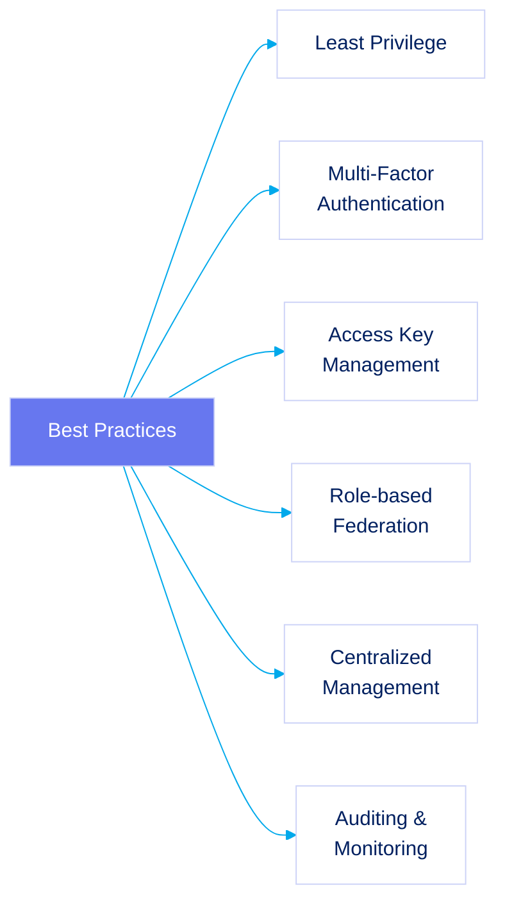
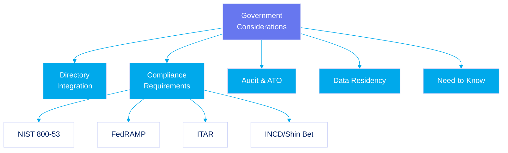

# Section 02: Identity and Access Management (IAM)

AWS IAM provides secure control over AWS resource access. In government and classified environments, IAM is critical for enforcing security policies, maintaining compliance, and preventing unauthorized access.

## Core IAM Concepts

- **Users:** Individuals or applications that interact with AWS

  - For humans: Use federation with existing identity providers
  - For applications: Use IAM users with programmatic access

- **Groups:** Collections of IAM users that simplify permissions management

- **Roles:** Designed for temporary credentials and used by:

  - AWS services
  - Applications on EC2 instances
  - Federated users

- **Policies:** JSON documents defining permissions that specify who can do what on which resources

## Policy Types and Their Application

- **Identity-based Policies:** Attached to users, groups, or roles
- **Resource-based Policies:** Attached directly to resources (e.g., S3 buckets)
- **Service Control Policies (SCPs):** Set maximum permissions across an organization
- **Permissions Boundaries:** Limit maximum permissions an identity-based policy can grant

## Best Practices for Government and Classified Environments

- **Principle of Least Privilege:** Grant only permissions required to perform tasks

- **Multi-Factor Authentication (MFA):** Enforce for all accounts, especially privileged ones

- **Access Key Management:**

  - Avoid embedding keys in code
  - Use IAM roles for EC2 instances
  - Use temporary credentials via AWS STS

- **Role Assumption and Federation:**

  - Use roles for temporary access
  - Federate identities from enterprise directories

- **Centralized IAM Management:** Use AWS Organizations with SCPs

- **Regular Auditing and Monitoring:**
  - Utilize CloudTrail, AWS Config, and Security Hub
  - Integrate with SIEM systems

## Government-Specific Considerations

- **Integration with Existing Directories:** Federate with on-premises identity systems

- **Compliance Requirements:**

  - NIST SP 800-53
  - FedRAMP
  - ITAR
  - Local regulations (e.g., Israeli National Cyber Directorate)

- **Audit Management and ATO:** IAM configurations are scrutinized during Authorization to Operate

- **Data Residency and Sovereignty:** Enforce geographic boundaries for sensitive data

- **Compartmentation:** Support "need-to-know" principles for classified environments

## Example: Classified Workload IAM Architecture

A classified workload processing sensitive data would include:

- **Federated access** for human users via AWS SSO
- **Least privilege roles** for applications
- **Resource-based policies** on sensitive data
- **SCPs** for organizational guardrails
- **Permissions boundaries** for administrative roles
- **MFA enforcement** for all human access
- **Automated key rotation** for any necessary long-term credentials

## Conclusion

IAM is the cornerstone of AWS security for government and classified environments. Proper implementation ensures sensitive data protection while maintaining operational capabilities required for critical missions.
