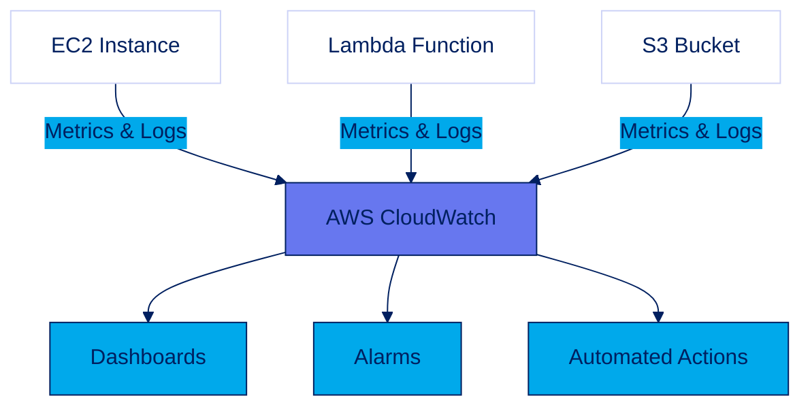
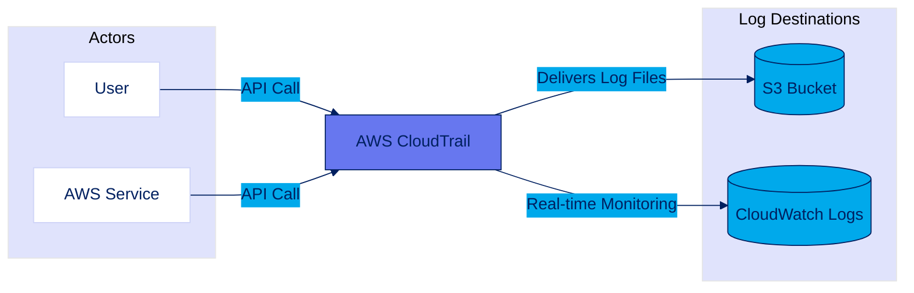
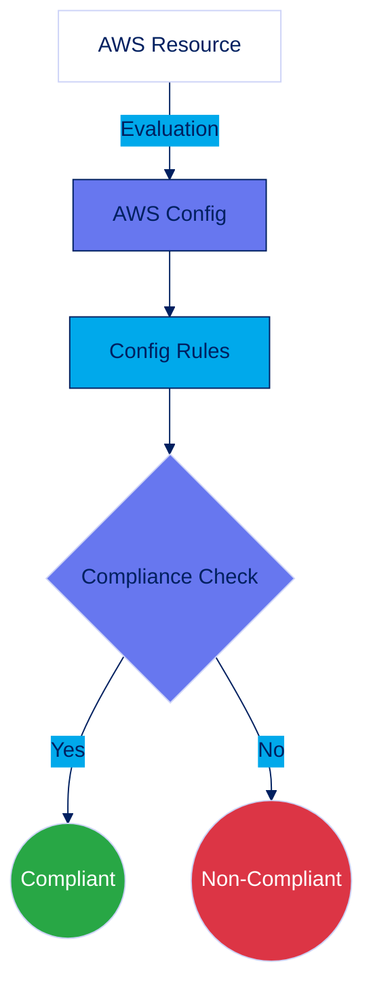
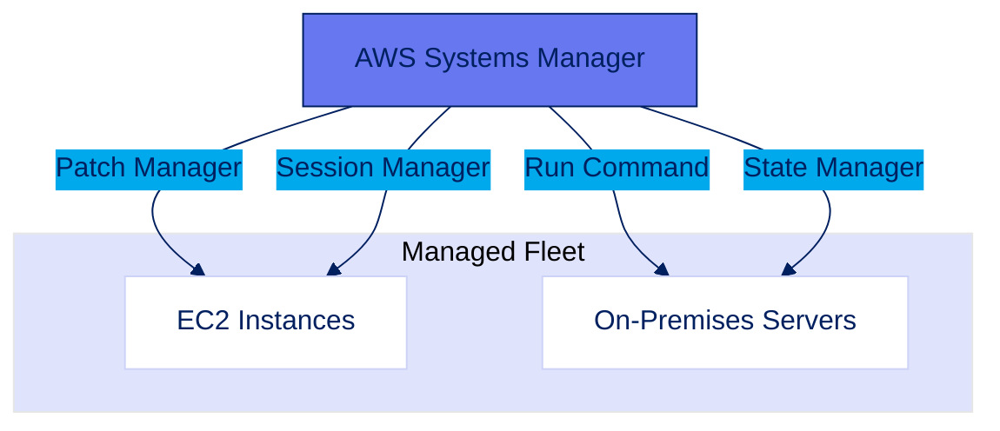
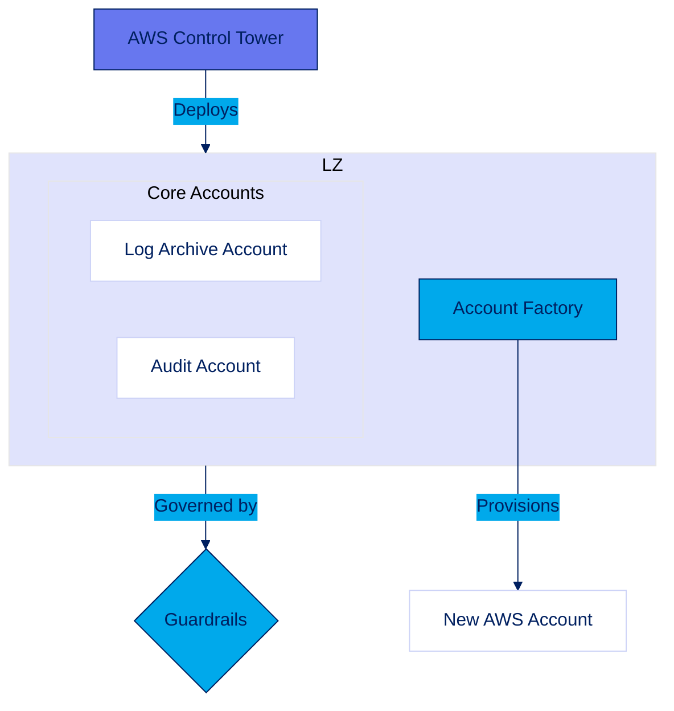
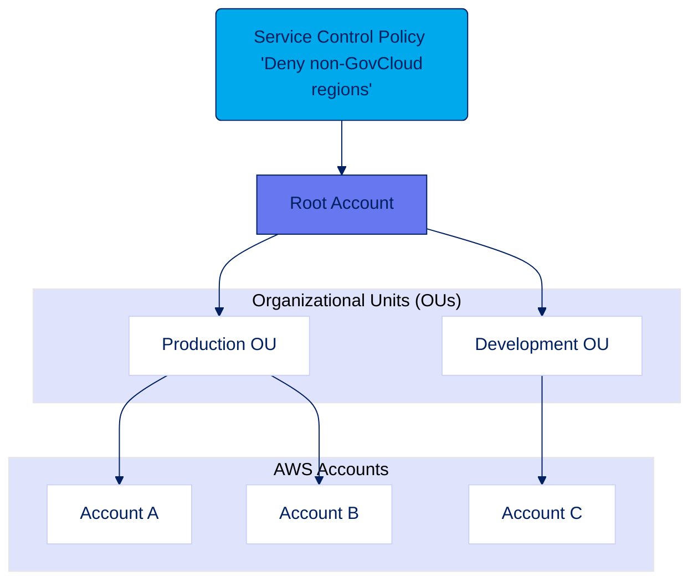

# Section 6: Management and Governance

Effective management and governance are crucial for maintaining control, security, and compliance in AWS, especially for government entities. This section explores key AWS services that provide a framework for operational excellence and robust security posture.

---

## AWS CloudWatch

CloudWatch is a core observability service that collects logs, metrics, and events. It provides actionable insights to monitor application health, respond to performance changes, and optimize resource usage, which is essential for maintaining the security and availability of government systems.

- **Core Functionality**: Centralizes monitoring by collecting **Metrics** (performance data), **Logs** (application/system records), and **Events** (resource state changes).
- **Key Use Cases**: Create unified **Dashboards**, set **Alarms** to trigger notifications or automated actions (e.g., auto-scaling), and use **Events** to build responsive, automated workflows.
- **Government Relevance**: Provides a comprehensive audit trail and enables proactive threat detection, meeting stringent compliance and security requirements.

---

## AWS CloudTrail

CloudTrail provides a complete record of user activity and API calls within your AWS accounts. It is the foundational service for governance, compliance, and security auditing, answering "who did what, and when?"

- **Core Functionality**: Records all AWS API calls as **Events**. These logs can be aggregated from multiple accounts into a central S3 bucket for long-term retention.
- **Architectural Pattern**: Centralize CloudTrail logs in a dedicated logging account. Enable **Log File Integrity Validation** to ensure logs are tamper-proof, a critical feature for classified environments.
- **Government Relevance**: Essential for forensic analysis, regulatory compliance (NIST, FedRAMP), and enforcing accountability for all actions within the environment.

---

## AWS Config

AWS Config continuously monitors and records your AWS resource configurations, allowing you to automate the evaluation of these configurations against desired policies. It is key to maintaining continuous compliance.

- **Core Functionality**: Provides a resource **Inventory**, **Configuration History**, and a rules engine (**Config Rules**) to check for compliance. **Conformance Packs** bundle rules for common compliance standards.
- **Architectural Pattern**: Combine Config Rules with **automated remediation** (via AWS Systems Manager) to automatically fix non-compliant resources, enforcing security policies in real time.
- **Government Relevance**: Enables continuous audit readiness, enforces strict configuration baselines, and helps proactively manage risk by identifying policy deviations.

---

## AWS Systems Manager

Systems Manager provides a unified interface for operational management and automation across AWS and hybrid environments. It helps maintain security and compliance by automating patching, configuration, and instance management.

- **Core Functionality**: Includes **Patch Manager** for automated patching, **Run Command** for remote execution, **State Manager** for configuration enforcement, and **Session Manager** for secure, auditable remote access without open ports.
- **Architectural Pattern**: Use **Session Manager** to eliminate the need for bastion hosts and direct SSH/RDP access, significantly reducing the attack surface.
- **Government Relevance**: Critical for secure operations in classified environments. Session Manager provides auditable remote access, while Patch and State Manager ensure systems adhere to mandated security baselines.

---

## AWS Control Tower

Control Tower provides the easiest way to set up and govern a secure, multi-account AWS environment. It automates the creation of a "landing zone," which is a baseline environment that follows AWS best practices.

- **Core Functionality**: Creates a **Landing Zone** with centralized logging and audit accounts. Uses **Guardrails** (preventive and detective controls) to enforce policies and an **Account Factory** to provision new, compliant accounts.
- **Architectural Pattern**: Serves as the starting point for building a scalable and secure multi-account architecture, ensuring governance is built-in from day one.
- **Government Relevance**: Establishes a standardized, secure, and compliant baseline across all government departments, simplifying large-scale deployments and reducing operational overhead.

---

## AWS Organizations

AWS Organizations is a foundational service for centrally managing and governing multiple AWS accounts. It allows you to apply policies, consolidate billing, and organize accounts into logical groups.

- **Core Functionality**: Group accounts into **Organizational Units (OUs)** and apply **Service Control Policies (SCPs)** to enforce permission boundaries for all accounts. Also provides **Consolidated Billing**.
- **Architectural Pattern**: The bedrock of a multi-account strategy. Use OUs to isolate workloads (e.g., production, development) and SCPs to implement high-level security guardrails that cannot be overridden by individual accounts.
- **Government Relevance**: Provides granular, centralized control over the entire AWS footprint, enabling compliance at scale and ensuring adherence to strict security mandates and budgetary controls.
