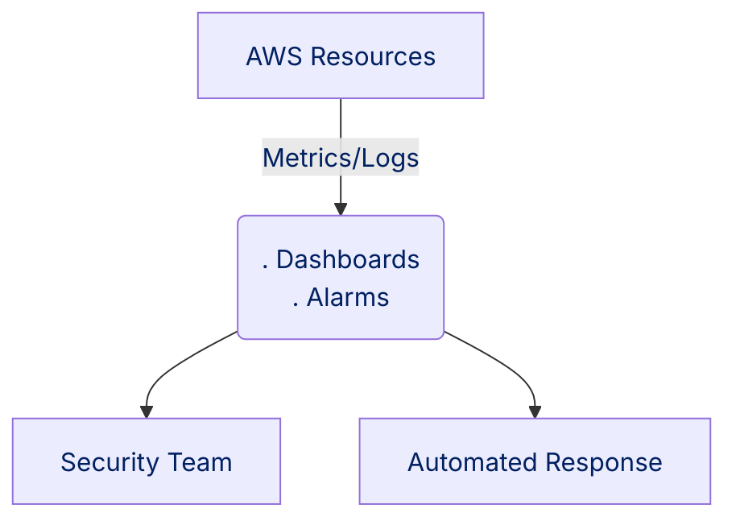
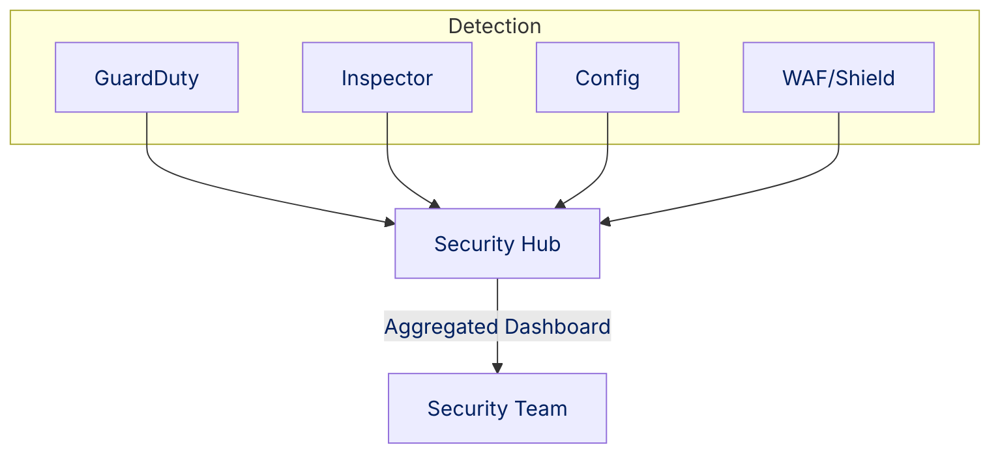
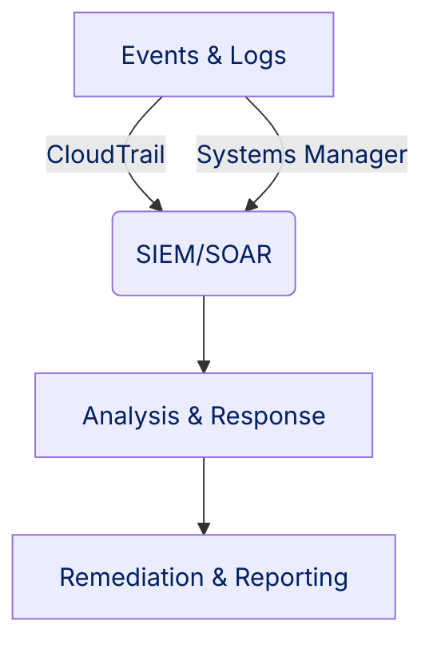

# Section 12: Monitoring, Detection, and Response with AWS Services

Maintaining security in AWS—especially for government and classified workloads—requires ongoing monitoring, automated threat detection, and strong incident response.

## 1. Monitoring with AWS CloudWatch

**Summary:**  
Centralizes metrics and logs from AWS resources. Sends alerts when thresholds or anomalies are detected.

**Key Features:**

- Metrics & dashboards for resource health
- Logs for audit and forensics
- Alarms for immediate notifications

## 2. Threat Detection with AWS Security Services

**Summary:**  
Automates threat identification and compliance across AWS accounts. Aggregates security findings and prioritizes risks.

**Key Services:**

- **Security Hub:** Central dashboard for findings & compliance.
- **GuardDuty:** ML-powered threat detection.
- **Inspector:** Vulnerability scans.
- **Config:** Configuration compliance checks.
- **WAF & Shield:** Web exploit and DDoS protection.

## 3. Incident Response and Operations

**Summary:**  
Logs actions, investigates breaches, and automates response tasks.

**Key Services:**

- **CloudTrail:** Tracks all actions for audits.
- **Systems Manager:** Executes commands, gathers evidence, applies patches securely.

**Integration:**  
SIEM/SOAR platforms connect for centralized incident analysis and automated workflows.

**Best Practice:**  
Enforce least privilege. Automate monitoring and response. Integrate all logs and alerts for unified security and compliance.
