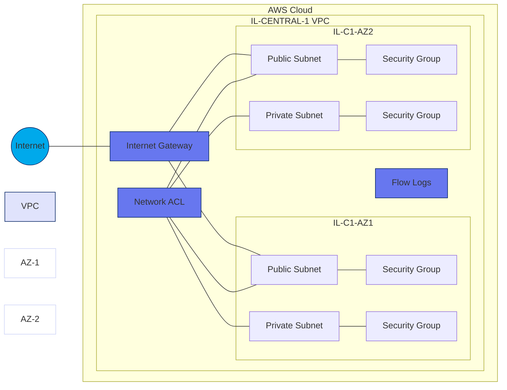
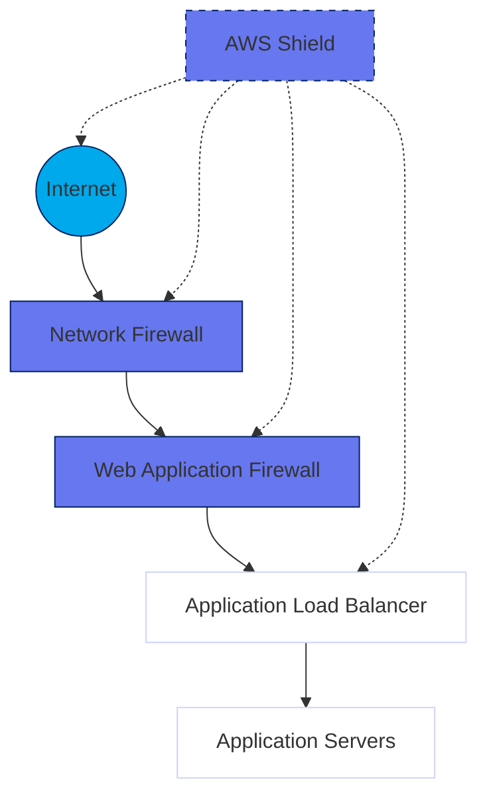
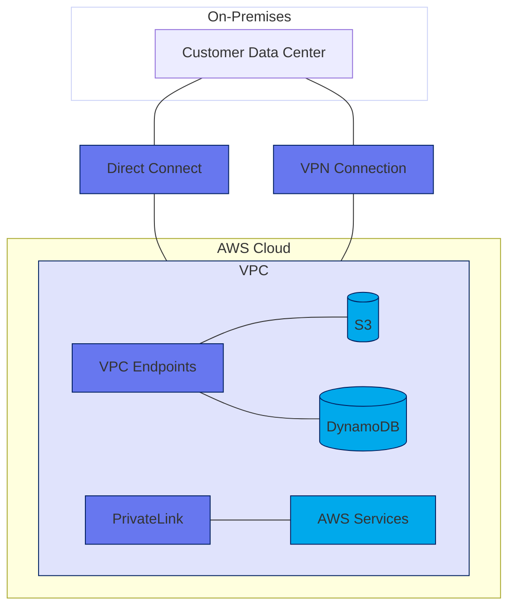
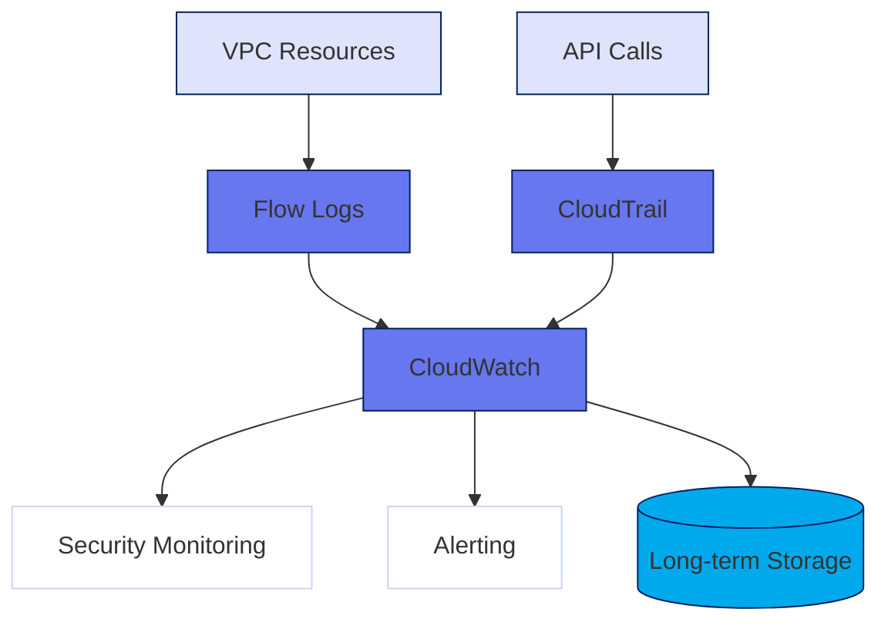
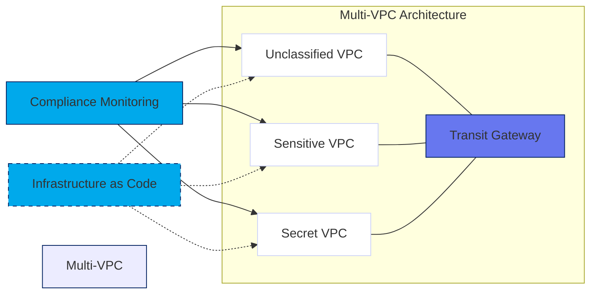

Here's the refactored content with concise descriptions and Mermaid diagrams to visually demonstrate key concepts:

# Section 03: Network Security Architecture

## Networking components

## VPC Fundamentals and Segmentation

AWS Virtual Private Cloud (VPC) provides isolated networks in the AWS cloud with customizable IP ranges, subnets, and routing.

- **Multi-AZ Design**: Deploy across multiple Availability Zones for high availability
- **Subnet Segregation**: Public subnets for internet-facing resources, private subnets for protected workloads
- **Security Controls**: Implement security groups (instance-level, stateful) and NACLs (subnet-level, stateless)
- **Monitoring**: Enable VPC Flow Logs for traffic analysis and security auditing

## Advanced Network Security Services

AWS provides specialized network security services to protect cloud workloads:

- **AWS Network Firewall**: Managed service for VPC protection with traffic filtering and inspection
- **AWS WAF**: Web Application Firewall protecting applications from OWASP Top 10 threats
- **AWS Shield**: DDoS protection service with Standard (basic) and Advanced (enhanced) tiers

## Secure Connectivity and Hybrid Cloud

Options for secure connections between on-premises networks and AWS:

- **Direct Connect**: Dedicated private connection bypassing public internet
- **VPN**: Encrypted connection over public internet
- **PrivateLink**: Private connectivity to AWS services without internet exposure
- **VPC Endpoints**: Connect to AWS services privately within the AWS network

## Network Monitoring and Logging

Comprehensive monitoring ensures security compliance and visibility:

- **VPC Flow Logs**: Records network traffic metadata
- **CloudTrail**: Logs API calls including network configuration changes
- **CloudWatch**: Collects metrics and logs for monitoring and alerting

## Government and Classified Environment Considerations

Special requirements for government cloud deployments:

- **Compliance**: Design for FedRAMP, DoD SRG, NIST 800-53 controls
- **Data Classification**: Segment networks based on data sensitivity levels
- **Infrastructure as Code**: Implement immutable infrastructure for consistency
- **Regular Testing**: Conduct security audits and penetration testing

