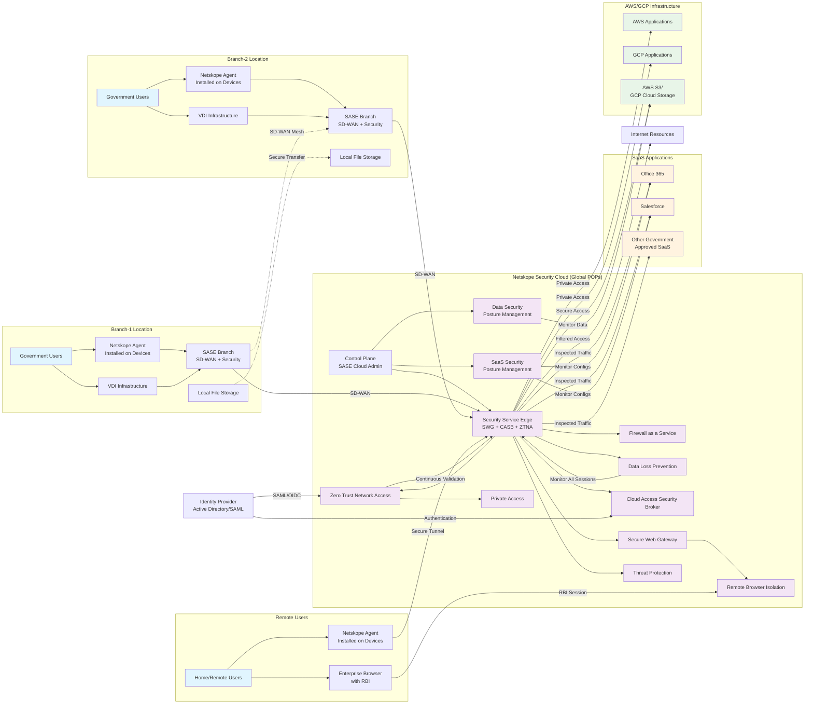

# SASE Architecture Implementation

Comprehensive SASE architecture that addresses all connectivity scenarios while implementing zero-trust principles and continuous security monitoring.

## Architecture Diagram

## Detailed Component Review and Data Flow

### 1. Core SASE Infrastructure Components

#### Control Plane (SASE Cloud Admin Management)

The Netskope Control Plane serves as the centralized management system for the entire SASE architecture. It provides:

- Unified policy management across all security services
- Real-time analytics and reporting for government compliance
- Configuration management for all SASE components
- Integration with government identity systems
- Audit trail generation for regulatory requirements

#### Security Service Edge (SSE)

The SSE acts as the primary traffic inspection and policy enforcement point, integrating:

- Real-time threat detection and prevention
- Content inspection and data classification
- Policy enforcement based on user identity and context
- SSL/TLS decryption and inspection for encrypted traffic
- Integration with government threat intelligence feeds

#### Agents (Installed on Managed Devices)

Netskope agents deployed on government devices provide:

- Real-time traffic steering to the security cloud
- Device posture assessment and reporting
- Offline protection capabilities
- Seamless user experience without VPN complexity
- Integration with government device management systems

### 2. Branch Location Architecture

#### SASE Branch Implementation

Each government branch location implements:

- **SD-WAN Capabilities**: Intelligent routing of traffic based on application requirements and security policies
- **Local Security Stack**: Edge-based security processing for latency-sensitive applications
- **Redundant Connectivity**: Multiple ISP connections with automatic failover
- **Local Caching**: Performance optimization for frequently accessed government applications

#### VDI Integration

Virtual Desktop Infrastructure integration provides:

- **Agent Integration**: Netskope agents within VDI templates for comprehensive protection
- **Session Monitoring**: Real-time monitoring of all VDI user activities
- **Data Protection**: DLP policies applied to all data accessed through virtual desktops
- **Performance Optimization**: Local breakout for non-sensitive traffic to maintain VDI performance

### 3. Security Components and Data Flow

#### Zero Trust Network Access (ZTNA)

ZTNA implementation ensures:

- **Identity Verification**: Integration with government Active Directory/SAML systems
- **Device Posture Assessment**: Continuous evaluation of device security status
- **Application-Specific Access**: Granular access controls based on government security classifications
- **Continuous Authorization**: Real-time validation of access permissions
- **Audit Logging**: Comprehensive logging of all access attempts and activities

**Data Flow**: User authentication → Device posture check → Application access validation → Secure tunnel establishment → Continuous monitoring

#### Cloud Access Security Broker (CASB)

CASB provides comprehensive SaaS protection:

- **API Integration**: Direct integration with Office 365, Salesforce, and other government-approved SaaS applications
- **Real-time Monitoring**: Continuous monitoring of user activities within cloud applications
- **Configuration Assessment**: Automated security configuration validation
- **Data Discovery**: Identification and classification of sensitive government data
- **Threat Detection**: Real-time detection of anomalous user behavior and potential threats

**Data Flow**: SaaS API calls → CASB inspection → Policy evaluation → Threat analysis → Action enforcement (allow/block/quarantine)

#### Data Loss Prevention (DLP)

Comprehensive DLP implementation includes:

- **Content Inspection**: Deep content analysis of all data in motion and at rest
- **Government Data Classification**: Integration with government data classification systems
- **Policy Enforcement**: Automated enforcement of data handling policies
- **Incident Response**: Automated response to data exfiltration attempts
- **Compliance Reporting**: Detailed reporting for government audit requirements

**Data Flow**: Data access attempt → Content analysis → Classification verification → Policy evaluation → Action enforcement → Audit logging

#### Secure Web Gateway (SWG)

SWG provides internet access protection:

- **URL Filtering**: Government-approved website access policies
- **SSL Inspection**: Decryption and inspection of encrypted web traffic
- **Malware Protection**: Real-time scanning for malicious content
- **Application Control**: Granular control over web application usage
- **Bandwidth Management**: Traffic prioritization for mission-critical applications

**Data Flow**: Web request → URL categorization → SSL decryption → Content scanning → Policy evaluation → Response delivery

#### Firewall as a Service (FWaaS)

Cloud-native firewall capabilities:

- **Stateful Inspection**: Advanced packet inspection and analysis
- **Intrusion Prevention**: Real-time threat detection and blocking
- **Application Layer Filtering**: Deep packet inspection for application-specific threats
- **Geo-blocking**: Location-based access restrictions
- **Custom Rules**: Government-specific security rules and policies

**Data Flow**: Network traffic → Packet inspection → Rule evaluation → Threat analysis → Traffic decision (allow/block/redirect)

### 4. Use Case Implementation Details

#### Use Case 1: Branch VDI to SaaS Applications

**Flow**: Branch User → VDI Session → Netskope Agent → SASE Branch → Security Cloud → IdP Authentication → CASB Inspection → SaaS Application

**Security Controls**:

- VDI session monitoring through embedded agents
- Identity verification against government Active Directory
- CASB real-time activity monitoring
- DLP scanning of all data transfers
- SSPM continuous configuration monitoring

#### Use Case 2: Branch VDI to AWS/GCP Applications

**Flow**: Branch User → VDI Session → Netskope Agent → SASE Branch → Security Cloud → ZTNA Validation → Private Access → Cloud Application

**Security Controls**:

- Zero-trust verification for each connection attempt
- Private Access tunneling for secure connectivity
- Continuous device posture assessment
- Application-specific access policies
- DSPM monitoring of cloud data access

#### Use Case 3: Remote to SaaS Applications

**Flow**: Remote User → Netskope Agent → Security Cloud → IdP Authentication → CASB Inspection → SaaS Application

**Security Controls**:

- Device-based agent providing secure tunnel
- Multi-factor authentication through government IdP
- Real-time behavioral analysis
- Enterprise Browser with Remote Browser Isolation for high-risk activities
- Continuous session monitoring

#### Use Case 4: Remote to AWS/GCP Applications

**Flow**: Remote User → Netskope Agent → Security Cloud → ZTNA Validation → Private Access → Cloud Application

**Security Controls**:

- Encrypted tunnel from endpoint to security cloud
- Context-aware access policies
- Application-level micro-segmentation
- Real-time threat protection
- Comprehensive audit logging

#### Use Case 5: Branch-to-Branch File Storage

**Flow**: Branch-1 → SASE Branch → SD-WAN Mesh → SASE Branch → Branch-2

**Security Controls**:

- Encrypted SD-WAN tunnels between branches
- DLP scanning of file transfers
- Access control based on user permissions
- File integrity monitoring
- Bandwidth optimization for large file transfers

#### Use Case 6: Branch to Cloud File Storage

**Flow**: Branch User → SASE Branch → Security Cloud → DSPM Validation → Cloud Storage

**Security Controls**:

- Data classification before cloud upload
- Encryption key management
- Access logging and monitoring
- DSPM continuous posture assessment
- Compliance policy enforcement

#### Use Case 7: Internet Access from Anywhere

**Flow**: User → Netskope Agent/SASE Branch → Security Cloud → SWG → Internet

**Security Controls**:

- Comprehensive web filtering
- SSL inspection and threat scanning
- Application usage monitoring
- Bandwidth management
- Malware protection and sandboxing

### 5. Continuous Monitoring and Compliance

#### ZTNA Continuous Monitoring

- Real-time validation of user identity and device posture
- Behavioral analysis for anomaly detection
- Session recording for audit purposes
- Automatic re-authentication based on risk factors
- Integration with government security orchestration platforms

#### DLP Session Monitoring

- Real-time content analysis of all user sessions
- Automated classification of government data
- Policy violation detection and prevention
- Incident response automation
- Comprehensive reporting for compliance audits

### 6. Additional Security Components

#### SaaS Security Posture Management (SSPM)

- Continuous monitoring of SaaS application configurations
- Automated security assessment reporting
- Configuration drift detection
- Compliance baseline validation
- Integration with government security standards

#### Data Security Posture Management (DSPM)

- Cloud data discovery and classification
- Security posture assessment of cloud storage
- Risk identification and remediation recommendations
- Compliance monitoring for government data regulations
- Integration with cloud provider security tools

#### Remote Browser Isolation (RBI)

- Isolation of high-risk web browsing activities
- Protection against web-based threats
- Safe access to untrusted websites
- Integration with Enterprise Browser
- Performance optimization for government users

This architecture provides comprehensive security coverage for all identified use cases while maintaining the flexibility and scalability required for government operations. The integration of multiple security services through the SASE framework ensures consistent policy enforcement and comprehensive protection across all access scenarios.
