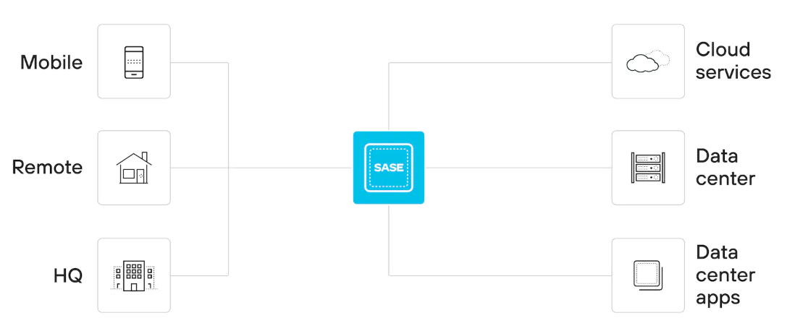
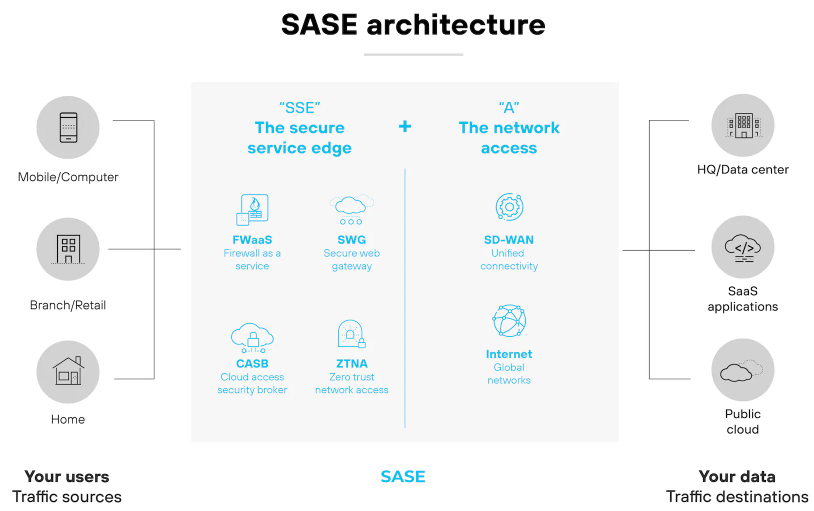

# Introduction to SASE (Secure Access Service Edge)

In the past, an organization's critical data and applications lived inside a secure data center, and users worked from an office connected to that network. Security was built around a strong perimeter. Today, that model has been completely inverted. Applications have moved to the cloud, data is distributed globally, and users can be anywhere. This fundamental shift has rendered traditional, perimeter-based security models ineffective and complex to manage.

**Secure Access Service Edge (SASE)** 
is a modern architectural framework designed to address these challenges. It converges networking and security functions into a single, unified service delivered from the cloud. Instead of forcing traffic back to a central data center for inspection, SASE brings the security stack to the user, wherever they are.

## What is SASE Architecture?

The core idea of SASE is to transform the network perimeter from a centralized location into a set of dynamic, cloud-based capabilities that can be deployed where and when they are needed.

In a SASE model, users and devices—whether at a branch office, at home, or on the move—connect to a nearby cloud gateway, often called a Point of Presence (PoP). At this PoP, a full stack of security services is applied to the traffic before it is routed to its destination, whether that's a SaaS application, a public cloud service, or a private data center.

This approach provides consistent and secure access to all applications while giving security teams full visibility and control over all traffic, regardless of its origin or destination.

## The Core Components of SASE

SASE is not a single product but rather an integration of several key technologies into a unified cloud service. The five essential components are:

1.  **Software-Defined Wide Area Network (SD-WAN)**: Provides an optimized and flexible network overlay, intelligently routing traffic between sites and directly to the cloud, decoupled from the underlying physical hardware.
2.  **Firewall as a Service (FWaaS)**: A cloud-native, next-generation firewall that provides advanced traffic inspection, access control, and threat prevention without the need for physical appliances.
3.  **Secure Web Gateway (SWG)**: Protects users from web-based threats by enforcing security policies, filtering malicious URLs, decrypting SSL, and preventing malware infections.
4.  **Cloud Access Security Broker (CASB)**: Discovers and controls the use of sanctioned and unsanctioned SaaS applications, enforcing data loss prevention (DLP) policies and protecting sensitive data in the cloud.
5.  **Zero Trust Network Access (ZTNA)**: Provides secure access to private applications based on the principle of "never trust, always verify." Access is granted on a per-session basis after verifying user identity and device context, rather than providing broad network access like a traditional VPN.

> **Further Reading:** Each of these components represents a complex and powerful technology. For a deeper understanding, please refer to our dedicated documents on SD-WAN, FWaaS, ZTNA, and other SASE pillars.

## SASE vs. Traditional Network Security

The SASE framework represents a significant paradigm shift from traditional network security models. The table below highlights the key differences.

| Feature             | Traditional Network Security                              | SASE (Secure Access Service Edge)                           |
| :------------------ | :-------------------------------------------------------- | :---------------------------------------------------------- |
| **Architecture**    | Hub-and-spoke; centralized data center                    | Cloud-native and globally distributed                       |
| **Perimeter**       | Defined by the physical network edge (the data center)    | Defined by user and device identity at the cloud edge       |
| **Security Stack**  | Collection of disparate physical/virtual appliances       | Integrated stack of services delivered from the cloud       |
| **Traffic Flow**    | Backhauled to the central data center for inspection      | Inspected at a nearby cloud PoP, then routed to destination |
| **User Experience** | Often slow for remote users and cloud apps due to latency | Optimized for low latency and direct-to-cloud access        |
| **Management**      | Complex; managed through multiple separate consoles       | Simplified; managed via a single, unified platform          |

## Key Benefits of Adopting SASE

By unifying networking and security, SASE provides numerous advantages for modern organizations:

- **Reduced Complexity:** Consolidates multiple point products from different vendors into a single, cloud-delivered service, simplifying management and reducing operational overhead.
- **Consistent Security:** Enforces the same robust security policies for all users, devices, and locations, eliminating the security gaps common in hybrid environments.
- **Improved Performance:** Optimizes network paths and reduces latency by routing traffic directly to the cloud and connecting users to the nearest PoP, enhancing the user experience.
- **Reduced Costs:** Lowers capital expenditures by eliminating the need for expensive on-premises security appliances and reduces operational costs through simplified management.
- **Greater Agility:** Allows organizations to quickly and securely connect new branches, support a hybrid workforce, and adopt new cloud services without complex network re-architecture.
