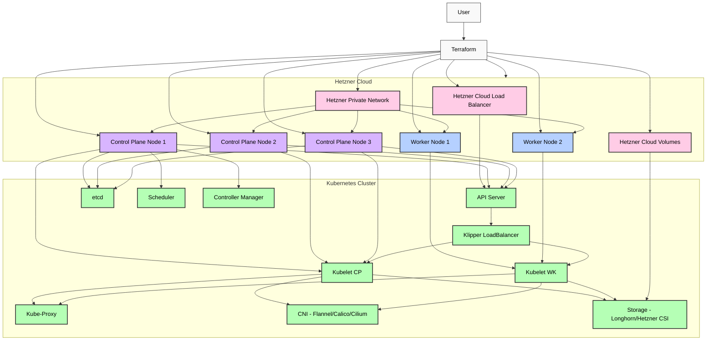

# Kube-Hetzner Architecture Diagram

## Explanation of Components:

- **User:** Interacts with the system, primarily through Terraform.
- **Terraform:** Infrastructure as Code tool responsible for provisioning and managing all Hetzner Cloud resources.
- **Hetzner Cloud:** The underlying cloud provider.
  - **Hetzner Cloud Load Balancer (HC_LB):** Used to expose the Kubernetes API server and potentially other services to external traffic.
  - **Hetzner Private Network (HC_PN):** Provides isolated and secure communication between all cluster nodes.
  - **Control Plane Nodes (HC_CP_VM1, HC_CP_VM2, HC_CP_VM3):** Virtual Machines hosting the Kubernetes control plane components. An odd number is used for High Availability.
  - **Worker Nodes (HC_WK_VM1, HC_WK_VM2):** Virtual Machines running user workloads.
  - **Hetzner Cloud Volumes (HC_VOL):** Block storage volumes used for persistent data.
- **Kubernetes Cluster (k3s):** The lightweight Kubernetes distribution.
  - **Kubernetes API Server (K8S_API):** The front-end for the Kubernetes control plane, exposing the Kubernetes API.
  - **etcd (K8S_ETCD):** Distributed key-value store used as Kubernetes' backing store for all cluster data.
  - **Scheduler (K8S_SCHED):** Watches for newly created Pods that have no assigned node, and selects a node for them to run on.
  - **Controller Manager (K8S_CTRL):** Runs controller processes that regulate the state of the cluster.
  - **Kubelet (K8S_KUBELET_CP, K8S_KUBELET_WK):** An agent that runs on each node in the cluster, ensuring that containers are running in a Pod.
  - **Kube-Proxy (K8S_PROXY):** Network proxy that runs on each node, implementing part of the Kubernetes Service concept.
  - **CNI (K8S_CNI):** Container Network Interface, responsible for pod networking (e.g., Flannel, Calico, Cilium).
  - **Storage (K8S_STORAGE):** Handles persistent storage for the cluster (e.g., Longhorn, Hetzner CSI Driver).
  - **Klipper LoadBalancer (K8S_KLB):** k3s's embedded on-metal load balancer for services of type `LoadBalancer`.

## Flow of Operations:

1.  **User Interaction:** The user defines the desired infrastructure using Terraform configuration files.
2.  **Terraform Provisioning:** Terraform interacts with the Hetzner Cloud API to provision all necessary resources: Load Balancers, Private Networks, Control Plane VMs, Worker VMs, and Cloud Volumes.
3.  **Network Connectivity:** All Control Plane and Worker Nodes are connected to the Hetzner Private Network for secure internal communication.
4.  **Kubernetes API Access:** The Hetzner Cloud Load Balancer exposes the Kubernetes API Server, providing a stable endpoint for `kubectl` access.
5.  **Control Plane Components:** Control Plane Nodes host the Kubernetes API Server, etcd, Scheduler, and Controller Manager, forming the brain of the cluster.
6.  **Node Agents:** Kubelet and Kube-Proxy run on both Control Plane and Worker Nodes to manage pods and network traffic.
7.  **Pod Networking:** The chosen CNI (Flannel, Calico, or Cilium) enables communication between pods across the cluster.
8.  **Persistent Storage:** Hetzner Cloud Volumes are integrated via the CSI driver or managed by Longhorn to provide persistent storage for stateful applications.
9.  **Internal Load Balancing:** Klipper LoadBalancer handles internal service exposure within the cluster.
