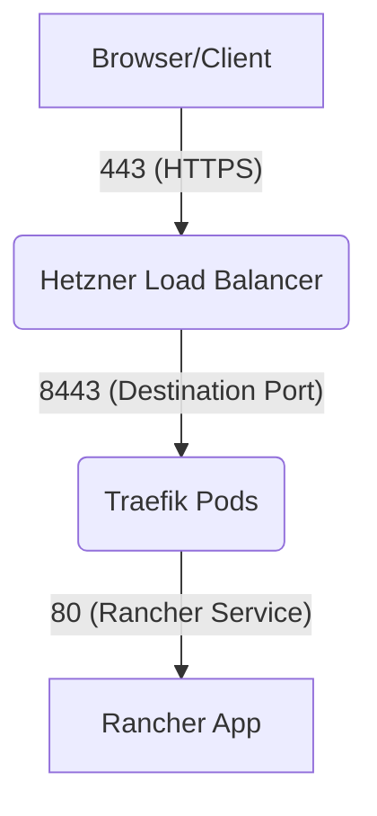

## 1. Project Overview

This document outlines a project to deploy a resilient, feature-rich, and cost-effective Kubernetes cluster on Hetzner Cloud using the Kube-Hetzner Terraform module. The goal is to create a "home lab" environment suitable for hosting various applications, complete with a web-based management UI and automated SSL.

**Key Components & Features:**

- **Infrastructure:** Deployed on Hetzner Cloud, leveraging its private network for security and low latency, and a Load Balancer for ingress traffic.
- **Base System:**
  - **OS:** openSUSE MicroOS, a hardened, transactional, and auto-updating container operating system.
  - **Kubernetes:** k3s, a lightweight, certified Kubernetes distribution.
- **Cluster Services:**
  - **Networking (CNI):** Cilium, providing high-performance eBPF-based networking, security, and observability, running in a full kube-proxy replacement mode.
  - **Ingress Controller:** Nginx to manage external access to cluster services.
  - **SSL Certificates:** Cert-Manager to automatically provision and renew Let's Encrypt TLS certificates for all public-facing services.
- **Core Applications:**
  - **Rancher:** A comprehensive web UI for managing the Kubernetes cluster.
  - **Cozystack:** A personal cloud application deployed as a Helm chart via Kustomize.
- **Architecture Principle:** The cluster is designed for High Availability (HA) with three control-plane nodes to ensure no downtime during automated upgrades and maintenance, as recommended by the Kube-Hetzner and k3s documentation.

## 2. Architecture

The architecture separates responsibilities across different layers for stability, security, and scalability.

### Node Architecture: Separation of Roles

The cluster is composed of two types of nodes, following Kubernetes best practices:

1.  **Control Plane Nodes (The Brain):**

    - **Quantity:** 3
    - **Responsibility:** Run the core Kubernetes management components (API server, scheduler, `etcd` database). They manage the cluster's state and decide where to run applications.
    - **Why Separate?** This isolates the critical management plane from user workloads, ensuring cluster stability and security. The HA setup with 3 nodes allows for rolling updates and fault tolerance.

2.  **Worker Nodes (The Muscle):**
    - **Quantity:** 2 (or more)
    - **Responsibility:** Execute the actual application workloads (containers). This is where Rancher, Cozystack, and the Nginx Ingress Controller will run.
    - **Why Separate?** This is where the heavy lifting happens. It allows for independent scaling of applications without impacting the cluster's control plane.

### Service Deployment

The following table details what services are installed and where they run within the cluster:

| Component                 | Installed By                                | Runs On                    | Why?                                                                                                                       |
| :------------------------ | :------------------------------------------ | :------------------------- | :------------------------------------------------------------------------------------------------------------------------- |
| **K3s System Components** | Kube-Hetzner Module                         | 🧠 **Control Plane Nodes** | These are the core brain components of Kubernetes and are restricted to the control plane for security and stability.      |
| **Cilium**                | Kube-Hetzner Module (`cni_plugin`)          | 🔵 **All Nodes**           | As a DaemonSet, Cilium runs on every node (control plane and worker) to manage the network traffic for that specific node. |
| **Nginx Ingress**         | Kube-Hetzner Module (`ingress_controller`)  | ✅ **Worker Nodes**        | It's a workload that routes external traffic to applications. It runs on workers, close to the services it serves.         |
| **Cert-Manager**          | Kube-Hetzner Module (`enable_cert_manager`) | ✅ **Worker Nodes**        | An application that watches for certificate requests and performs the work of acquiring them.                              |
| **Rancher**               | Kube-Hetzner Module (`enable_rancher`)      | ✅ **Worker Nodes**        | A user-facing management application that runs as a standard workload scheduled by the control plane.                      |
| **Cozystack**             | Kustomize (`extra-manifests` folder)        | ✅ **Worker Nodes**        | This is the primary user application. All user workloads are placed on worker nodes by default.                            |

---

### 3. Architecture Diagram

This diagram visualizes the complete High-Availability setup, including the flow of traffic from the user to the applications.

<div id="architecture-diagram" style={{ width: '100%', maxWidth: '900px', margin: '0 auto', fontFamily: 'Arial, sans-serif' }}>
  <svg width="100%" viewBox="0 0 900 750" style={{ border: '1px solid #eee', borderRadius: '5px' }}>
    <!-- Background -->
    <rect width="900" height="900" fill="#f8f9fa" rx="10" ry="10"/>
    <!-- Hetzner Cloud -->
    <rect x="50" y="50" width="800" height="650" fill="#e6f7ff" stroke="#0099cc" stroke-width="2" rx="10" ry="10"/>
    <text x="450" y="80" text-anchor="middle" font-size="20" font-weight="bold" fill="#0066cc">Hetzner Cloud</text>
    <!-- Network -->
    <rect x="100" y="100" width="700" height="575" fill="#f0f8ff" stroke="#66aaff" stroke-width="2" rx="10" ry="10" stroke-dasharray="5,5"/>
    <text x="450" y="125" text-anchor="middle" font-size="16" fill="#0066cc">Private Network (10.0.0.0/16)</text>
    <!-- Control Plane Nodes (HA Setup) -->
    <rect x="120" y="150" width="230" height="130" fill="#fff" stroke="#333" stroke-width="2" rx="5" ry="5"/>
    <text x="235" y="175" text-anchor="middle" font-size="16" font-weight="bold">Control Plane </text>
    <text x="235" y="195" text-anchor="middle" font-size="14">cpx21 (HA Quorum)</text>
    <rect x="140" y="210" width="190" height="50" fill="#e6ffe6" stroke="#009900" stroke-width="1" rx="5" ry="5"/>
    <text x="235" y="240" text-anchor="middle" font-size="14">🧠 K3s Control Plane (etcd)</text>
    <!-- Worker Nodes -->
    <rect x="120" y="320" width="230" height="300" fill="#fff" stroke="#333" stroke-width="2" rx="5" ry="5"/>
    <text x="235" y="345" text-anchor="middle" font-size="16" font-weight="bold">Worker Nodes (2 Nodes)</text>
    <text x="235" y="365" text-anchor="middle" font-size="14">cpx21 (Application Hosts)</text>
    <rect x="140" y="385" width="190" height="220" fill="#cce5ff" stroke="#004085" stroke-width="1" rx="5" ry="5"/>
    <text x="235" y="410" text-anchor="middle" font-size="14" font-weight="bold">✅ Application Pods</text>
    <text x="235" y="440" text-anchor="middle" font-size="12">- Rancher</text>
    <text x="235" y="460" text-anchor="middle" font-size="12">- Cozystack</text>
    <text x="235" y="480" text-anchor="middle" font-size="12">- Nginx Ingress Controller</text>
    <text x="235" y="500" text-anchor="middle" font-size="12">- Cert-Manager</text>
    <!-- Load Balancer -->
    <rect x="435" y="150" width="230" height="80" fill="#fff" stroke="#333" stroke-width="2" rx="5" ry="5"/>
    <text x="550" y="175" text-anchor="middle" font-size="16" font-weight="bold">Hetzner Load Balancer</text>
    <text x="550" y="200" text-anchor="middle" font-size="14">Routes HTTPS (443) to Workers</text>
    <!-- Kubernetes Services -->
    <rect x="370" y="250" width="450" height="370" fill="#fff" stroke="#333" stroke-width="2" rx="5" ry="5"/>
    <text x="595" y="275" text-anchor="middle" font-size="16" font-weight="bold">Kubernetes Service Layer</text>
    <!-- Service Definitions -->
    <rect x="385" y="295" width="130" height="90" fill="#d4edda" stroke="#155724" stroke-width="1" rx="5" ry="5"/>
    <text x="450" y="320" text-anchor="middle" font-size="14" font-weight="bold">Cilium (CNI)</text>
    <text x="450" y="345" text-anchor="middle" font-size="12">eBPF Networking</text>
    <text x="450" y="365" text-anchor="middle" font-size="12">Runs on All Nodes</text>
    <rect x="530" y="295" width="130" height="90" fill="#ffecb3" stroke="#e6ac00" stroke-width="1" rx="5" ry="5"/>
    <text x="595" y="320" text-anchor="middle" font-size="14" font-weight="bold">Nginx Ingress</text>
    <text x="595" y="345" text-anchor="middle" font-size="12">L7 Routing</text>
    <text x="595" y="365" text-anchor="middle" font-size="12">TLS Termination</text>
    <rect x="675" y="295" width="130" height="90" fill="#ffecb3" stroke="#e6ac00" stroke-width="1" rx="5" ry="5"/>
    <text x="740" y="320" text-anchor="middle" font-size="14" font-weight="bold">Cert Manager</text>
    <text x="740" y="345" text-anchor="middle" font-size="12">Automated SSL</text>
    <text x="740" y="365" text-anchor="middle" font-size="12">Let's Encrypt</text>
    <!-- Applications -->
    <rect x="385" y="405" width="160" height="80" fill="#d1ecf1" stroke="#0c5460" stroke-width="1" rx="5" ry="5"/>
    <text x="450" y="430" text-anchor="middle" font-size="14" font-weight="bold">Rancher</text>
    <text x="460" y="450" text-anchor="middle" font-size="12">Cluster Mgmt UI</text>
    <text x="460" y="470" text-anchor="middle" font-size="12">rancher.your-domain.com</text>
    <rect x="550" y="405" width="160" height="80" fill="#d1ecf1" stroke="#0c5460" stroke-width="1" rx="5" ry="5"/>
    <text x="630" y="430" text-anchor="middle" font-size="14" font-weight="bold">Cozystack</text>
    <text x="630" y="450" text-anchor="middle" font-size="12">Personal Cloud</text>
    <text x="630" y="470" text-anchor="middle" font-size="12">cozy.your-domain.com</text>
    <!-- External User -->
    <circle cx="550" cy="40" r="20" fill="#fff" stroke="#333" stroke-width="2"/>
    <text x="550" y="45" text-anchor="middle" font-size="14">👤</text>
    <!-- Connection Lines -->
    <line x1="550" y1="60" x2="550" y2="150" stroke="#666" stroke-width="2" stroke-dasharray="5,5"/>
    <polygon points="550,150 545,140 555,140" fill="#666"/>
    <line x1="550" y1="230" x2="595" y2="295" stroke="#666" stroke-width="2"/>
    <polygon points="595,295 590,285 600,285" fill="#666"/>
    <line x1="350" y1="215" x2="370" y2="400" stroke="#0066cc" stroke-width="2" stroke-dasharray="3,3"/>
    <text x="360" y="320" text-anchor="middle" font-size="12" fill="#0066cc" transform="rotate(-70 360,320)">Manages</text>
  </svg>
</div>

---

## 4. Step-by-Step Deployment Guide

### Step 0: Prerequisites

1.  **Hetzner Cloud Account:** Ensure you have an account and a project created.
2.  **API Token:** Generate a **Read & Write** API token from your Hetzner Cloud project console.
3.  **SSH Key:** Generate a passphrase-less `ed25519` or `rsa` SSH key pair (e.g., `~/.ssh/id_rsa` and `~/.ssh/id_rsa.pub`).
4.  **CLI Tools:** Install the required tools using Homebrew (or your preferred package manager):
    ```sh
    brew install terraform kubectl hcloud packer coreutils
    ```
5.  **Configure Hetzner CLI:** Set up a context for the Hetzner CLI. This makes it easier to inspect resources manually.
    ```sh
    hcloud context create my-homelab
    # Paste your API token when prompted.
    ```

### Step 1: Create Project Structure

Create the following directory structure. This is essential for Kustomize to find the extra manifest files.

```
home-lab/
├── extra-manifests
│   ├── cozy-stack-namespace.yaml
│   ├── cozystack-helmchart.yaml.tpl
│   ├── cozystack-values.yaml.tpl
│   ├── kustomization.yaml.tpl
│   └── letsencrypt-issuer.yaml.tpl
└── kube.tf
```

### Step 2: Create Configuration Files

##### Create `TF_VAR_hcloud_token`

```bash
export TF_VAR_hcloud_token="YOUR_HETZNER_API_TOKEN"
```

##### Copy the following code into the corresponding files

```bash
# FILE: homelab/extra-manifests/cozy-stack-namespace.yaml

apiVersion: v1
kind: Namespace
metadata:
  name: cozy-stack

#############################################################
#############################################################

# FILE: homelab/extra-manifests/cozystack-helmchart.yaml.tpl

apiVersion: helm.cattle.io/v1
kind: HelmChart
metadata:
  name: cozy-stack
  namespace: cozy-stack
spec:
  repo: https://cozy.github.io/cozy-stack/
  chart: cozy-stack
  version: "4.12.0"
  targetNamespace: cozy-stack
  valuesContent: |
${cozystack_rendered_values}
#############################################################
#############################################################

# FILE: homelab/extra-manifests/cozystack-values.yaml.tpl

ingress:
  enabled: true
  hostname: cozy.${domain}
  annotations:
    nginx.ingress.kubernetes.io/ssl-redirect: "true"
    cert-manager.io/cluster-issuer: "${cluster_issuer}"
  tls:
    - secretName: cozy-tls-secret
      hosts:
        - cozy.${domain}
#############################################################
#############################################################

# FILE: homelab/extra-manifests/kustomization.yaml.tpl

resources:
- letsencrypt-issuer.yaml
- cozy-stack-namespace.yaml
- cozystack-helmchart.yaml

patches:
- target:
    kind: Deployment
    name: system-upgrade-controller
    namespace: system-upgrade
  patch: |-
    - op: replace
      path: /spec/replicas
      value: 0
#############################################################
#############################################################

# FILE: homelab/extra-manifests/letsencrypt-issuer.yaml.tpl

apiVersion: cert-manager.io/v1
kind: ClusterIssuer
metadata:
  name: ${cluster_issuer}
spec:
  acme:
    email: ${admin_email}
    server: https://acme-v02.api.letsencrypt.org/directory
    privateKeySecretRef:
      name: ${cluster_issuer}-account-key
    solvers:
    - http01:
        ingress:
          class: nginx
#############################################################
#############################################################

# FILE: homelab/kube.tf

locals {
  hcloud_token = ""
  cluster_name           = "homelab"
  domain                 = "nc555.online"
  admin_email            = "naticabti@gmail.com"
  rancher_bootstrap_password = "*HJCo*yhZkhjZnb2n7KbAiJ7*P8Ec9PyngmBVLo.tWp8wNL6N_"
  load_balancer_location = "nbg1"
  load_balancer_type     = "lb11"

  # Render cozystack-values.yaml.tpl here to pass its content to the HelmChart manifest
  cozystack_rendered_values_content = templatefile("${path.module}/extra-manifests/cozystack-values.yaml.tpl", {
    domain         = local.domain
    cluster_issuer = "letsencrypt-prod"
  })
}

module "kube-hetzner" {
  source = "kube-hetzner/kube-hetzner/hcloud"
  version = "2.11.8"

  providers = {
    hcloud = hcloud
  }

  # Basic configuration
  hcloud_token    = var.hcloud_token != "" ? var.hcloud_token : local.hcloud_token
  cluster_name    = local.cluster_name
  ssh_public_key  = file("~/.ssh/id_ed25519.pub")
  ssh_private_key = file("~/.ssh/id_ed25519")
  network_region  = "eu-central"

  # Node pools
  control_plane_nodepools = [
    {
      name        = "control-plane"
      server_type = "cx32"
      location    = "nbg1"
      labels      = []
      taints      = []
      count       = 1
    }
  ]

  agent_nodepools = [
    {
      name        = "worker"
      server_type = "cx32"
      location    = "nbg1"
      labels      = []
      taints      = []
      count       = 2
    }
  ]

  # Load Balancer
  use_control_plane_lb   = true
  load_balancer_type     = local.load_balancer_type
  load_balancer_location = local.load_balancer_location

  # CNI
  cni_plugin = "cilium"
  cilium_values = <<-EOT
ipam:
  mode: kubernetes
k8s:
  requireIPv4PodCIDR: true
kubeProxyReplacement: "strict"
routingMode: native
ipv4NativeRoutingCIDR: "10.0.0.0/8"
endpointRoutes:
  enabled: true
loadBalancer:
  acceleration: native
bpf:
  masquerade: true
hubble:
  enabled: true
MTU: 1450
  EOT

  # Ingress
  ingress_controller    = "nginx"
  ingress_replica_count = 2
  nginx_values = <<-EOT
controller:
  watchIngressWithoutClass: "true"
  kind: "Deployment"
  config:
    "use-forwarded-headers": "true"
    "compute-full-forwarded-for": "true"
    "use-proxy-protocol": "true"
  service:
    annotations:
      "load-balancer.hetzner.cloud/name": "${local.cluster_name}"
      "load-balancer.hetzner.cloud/use-private-ip": "true"
      "load-balancer.hetzner.cloud/disable-private-ingress": "true"
      "load-balancer.hetzner.cloud/location": "${local.load_balancer_location}"
      "load-balancer.hetzner.cloud/type": "${local.load_balancer_type}"
      "load-balancer.hetzner.cloud/uses-proxyprotocol": "true"
  EOT

  # Cert Manager
  enable_cert_manager = true

  # Rancher
  enable_rancher = true
  rancher_hostname = "rancher.${local.domain}"
  rancher_values = <<-EOT
hostname: "rancher.${local.domain}"
replicas: 1
bootstrapPassword: "${local.rancher_bootstrap_password}"
ingress:
  tls:
    source: letsEncrypt
  extraAnnotations:
    cert-manager.io/cluster-issuer: "letsencrypt-prod"
  EOT

  # Extra manifests
  extra_kustomize_parameters = {
    domain                  = local.domain
    cluster_issuer          = "letsencrypt-prod"
    admin_email             = local.admin_email
    cozystack_rendered_values = local.cozystack_rendered_values_content
  }

  # System upgrade controls (CORRECTED)
  automatically_upgrade_os  = false
  automatically_upgrade_k3s = false
}

provider "hcloud" {
  token = var.hcloud_token != "" ? var.hcloud_token : local.hcloud_token
}

terraform {
  required_version = ">= 1.5.0"
  required_providers {
    hcloud = {
      source  = "hetznercloud/hcloud"
      version = ">= 1.51.0"
    }
  }
}

variable "hcloud_token" {
  description = "Hetzner Cloud API Token"
  sensitive   = true
  default     = ""
}

output "kubeconfig_content" {
  description = "The content of the kubeconfig file"
  value       = module.kube-hetzner.kubeconfig
  sensitive   = true
}
=======================
```

### Step 3: Deploy the Cluster

1.  **Create MicroOS Snapshot:** The first time you use Kube-Hetzner, you must create a base OS image snapshot. Navigate to your `home-lab` directory and run the official creation script.

```bash
# This downloads and runs a script that creates required files and builds the Packer image.
tmp_script=$(mktemp) && curl -sSL -o "${tmp_script}" https://raw.githubusercontent.com/kube-hetzner/terraform-hcloud-kube-hetzner/master/scripts/create.sh && chmod +x "${tmp_script}" && "${tmp_script}" && rm "${tmp_script}"
```

Follow the prompts. You will need to provide your Hetzner API token again. This step can take 5-10 minutes.

2.  **Run Terraform:** Once the snapshot is created, deploy the cluster using the standard Terraform workflow.

```bash
# 🏠 Navigate to your home-lab directory
cd home-lab


# 🧹 Clean up previous Terraform state files
rm -rf .terraform .terraform.lock.hcl


####################################################
################🚀 Initialization Options ##########
# -----------------------
# 🔰 First-time initialization
terraform init

# 🔄 Re-initialization (changes backends)
terraform init -reconfigure

# ⬆️ Upgrade modules to latest versions
terraform init --upgrade


####################################################
############ 📝 Plan Creation Options ##############
# Create and save plan file
terraform plan -out=tfplan

# Export plan as JSON for inspection
terraform show -json tfplan > tfplan.json

# Export plan as text for review
terraform show tfplan > tfplan.txt


#####################################################
############## ⚙️ Apply Options #####################
# ✅ Apply using saved plan file (safest)
terraform apply "tfplan"

# ⚡ Apply directly with auto-approval (use with caution)
terraform apply -auto-approve

# take down the cluster
terraform destroy -auto-approve
```

### Step 4: Access Your Services

1.  **Configure DNS:**

    - After the `terraform apply` command completes, get the public IP address of your Load Balancer:

    ```bash
    # get the load-balancer ip
    terraform output load_balancer_ip
    #error is expected since We  the
    #`load_balancer_ip and  `control_plane_lb_ip` removed from  `kube.tf`

    # hcloud loadbalancer list since it is not available via terraform output
    hcloud loadbalancer list
    # hcloud loadbalancer list responsed with
    ID        NAME                    HEALTH    IPV4          IPV6                    TYPE   LOCATION   NETWORK ZONE   AGE
    4192462   homelab-control-plane   mixed     99.99.99.999   2a01:4f8:2a01:4f8::1   lb11   nbg1       eu-central     56m
    4192463   homelab-nginx           healthy   99.99.99.888   2a01:4f8:2a01:4f8::1   lb11   nbg1       eu-central     56m
    4192525   homelab                 healthy   99.99.99.777   2a01:4f8:2a01:4f8::1   lb11   nbg1       eu-central     38m


    ```

Go to your DNS provider and create **two `A` records** pointing to this IP address:
_ `rancher.your-domain.com` -> `LOAD_BALANCER_IP`
_ `cozy.your-domain.com` -> `LOAD_BALANCER_IP`

2.  **Configure `kubectl`:** \* The `kubeconfig` file will be saved in your project directory. To use it easily, set the `KUBECONFIG` environment variable:

    ````bash
    export KUBECONFIG=$(terraform output -raw kubeconfig_local_path) # Test the connection
    kubectl get nodes # If set KUBECONFIG environment variable
    kubectl get nodes -o wide # If you did not set KUBECONFIG environment variable
    kubectl --kubeconfig homelab_kubeconfig.yaml get nodes -o wide

        # most important columns for your nodes

    kubectl --kubeconfig homelab_kubeconfig.yaml get nodes -o custom-columns="NAME:.metadata.name,STATUS:.status.conditions[?(@.type=='Ready')].status,ROLE:.metadata.labels.node-role\.kubernetes\.io/control-plane,INTERNAL-IP:.status.addresses[?(@.type=='InternalIP')].address,EXTERNAL-IP:.status.addresses[?(@.type=='ExternalIP')].address,VERSION:.status.nodeInfo.kubeletVersion"

        ```

    ````

3.  SSH into any control plane node to manage your workloads directly

    ```sh
    ssh root@<control-plane-ip> -i /path/to/private_key -o StrictHostKeyChecking=no
    ```

4.  **Access Your UIs:**
    - Wait a few minutes for the DNS to propagate and for Cert-Manager to issue SSL certificates. You can then access your services in a web browser:
      - **Rancher:** `https://rancher.your-domain.com`
      - **Cozystack:** `https://cozy.your-domain.com`

### step 5: Configure DNS and Access Services

#### DNS Records

1. **Configure DNS Records for `nc555.online`:**  
   Go to your DNS provider's control panel (for `nc555.online`) and create two `A` records that point to the **`homelab` Load Balancer's IPv4 address (`loadbalancer-homelab-ip)**:

   - `A` record for `rancher.nc555.online` pointing to `99.99.99.777`
   - `A` record for `cozy.nc555.online` pointing to `99.99.99.777`

   **Important:** The `homelab-control-plane` LB is not used for these public facing applications.

2. **Wait for DNS Propagation & SSL Certificates:**

   - DNS changes can take some time to propagate globally (anywhere from a few minutes to a few hours, depending on your DNS provider's TTL settings).
   - Once DNS is propagated, Cert-Manager (which you enabled and configured via Kustomize) will automatically attempt to provision Let's Encrypt SSL certificates for `rancher.nc555.online` and `cozy.nc555.online`. This process can also take a few minutes (typically 5-15 minutes after DNS is correct).

3. **Access Your UIs:**  
   After waiting for DNS and SSL:

   - **Rancher:** Open `https://rancher.nc555.online` in your web browser. You should be prompted to set up the initial admin password (or use the `rancher_bootstrap_password` you set).
   - **Cozystack:** Open `https://cozy.nc555.online` in your web browser.

#### Hetzner Load Balancer Status

```bash
# load balancer list
hcloud load-balancer list

# load balancer details
# hcloud load-balancer describe <load-balancer-name>
hcloud load-balancer describe homelab-traefik

## Result
ID:                             4203225
Name:                           homelab-traefik
Created:                        Fri Aug  1 15:20:39 IDT 2025 (2 hours ago)
Public Net:
  Enabled:                      yes
  IPv4:                         <ip-v4-lb>
  IPv4 DNS PTR:                 static.<ip-v4-lb>.clients.your-server.de
  IPv6:                         <ip-v6-lb>
Services:
  - Protocol:                   tcp
    Listen Port:                80
    Destination Port:           32726
    Proxy Protocol:             yes
    Health Check:
  - Protocol:                   tcp
    Listen Port:                443
    Destination Port:           31012   ❗❗🔁traefik.entryPoints.websecure.address
    Proxy Protocol:             yes

```

#### Traefik Ingress Controller

###### Get Traefik pods

```bash
# get the traefik pods name list
kubectl get pods  --namespace <traefik-namespace>
kubectl get pods  --namespace traefik

# get the traefik pods status
kubectl get deployments.apps --namespace <traefik-namespace>
kubectl get deployments.apps --namespace traefik


```

###### Get Traefik Config

```bash
#Verify that Traefik is properly configured
kubectl get deployment -n traefik -l app.kubernetes.io/name=<traefik-namespace>  -o yaml

kubectl get deployment -n traefik -l app.kubernetes.io/name=traefik  -o yaml

apiVersion: v1
items:
- apiVersion: apps/v1
  kind: Deployment
  metadata:
    annotations:
	...
	...
  spec:
    template:
      spec:
        automountServiceAccountToken: true
        containers:
        - args:
          - --global.checkNewVersion
          - --entryPoints.metrics.address=:9100/tcp
          - --entryPoints.traefik.address=:8080/tcp
          - --entryPoints.web.address=:8000/tcp
          - --entryPoints.websecure.address=:8443/tcp  ❗❗🔁 Destination Port

```

###### Check Traefik Pod Logs

```bash
# get logs of any Traefik pod:
kubectl logs -n traefik -l app.kubernetes.io/name=<traefik-namespace> -f
kubectl logs -n traefik -l app.kubernetes.io/name=traefik -f
```

#### Hetzner Load Balancer set destination port

Set `Hetzner Load Balancer` destination port equal the `Traefik Ingress Controller` value of `entryPoints.websecure.address`

```bash
hcloud load-balancer update-service --listen-port 443 --protocol tcp --destination-port 8443 --proxy-protocol --health-check-protocol tcp --health-check-port 8443 --health-check-interval 15s --health-check-timeout 10s --health-check-retries 3 homelab-traefik
--health-check-retries 3
```

#### SNI (Server Name Indication) and Direct Connectivity Test

Handling TLS Certs assignments issues to `hostname



```bash
openssl s_client -connect <load-balancer-ip>:443 -servername <hostname>
```

### step 6: Nginx Troubleshooting TLS & DNS Issues

Okay, your cluster is up and running, and the nodes are ready, which is great progress! Now we're debugging the application layer.

The issues you're seeing (`nginx error` for Cozy and `not getting tls certificate` for Rancher) indicate that:

1.  **Traffic is reaching your Nginx Ingress Load Balancer (`91.98.6.126`)**: The "nginx error" means Nginx received the request.
2.  **Something is wrong with the routing or the backend services, and/or Cert-Manager is failing to issue certificates.**

Let's methodically diagnose this. We need to check the status of the various Kubernetes components.

**First, ensure your `homelab_kubeconfig.yaml` is active:**

```bash
export KUBECONFIG=homelab_kubeconfig.yaml
```

**Cluster Health & Pods**

```bash
kubectl get pods -A
```

Now, let's run some `kubectl` commands.

---

### Diagnosis Steps:

**1. Check Core Cluster Health & Pods:**

```bash
kubectl get pods -A
```

- **What to look for:** Any pods stuck in `Pending`, `Error`, or `CrashLoopBackOff` states.
- Specifically check pods in `nginx`, `cert-manager`, `cattle-system` (Rancher), and `cozy-stack` namespaces.

**2. Check Nginx Ingress Controller Status:**

```bash
kubectl get deployments -n nginx
kubectl get services -n nginx
kubectl describe deployment -n nginx nginx-ingress-controller
kubectl logs -n nginx -l app.kubernetes.io/name=ingress-nginx -c controller --tail=50
```

- **What to look for:**
  - `deployments`: Is `nginx-ingress-controller` deployment `READY` (e.g., `2/2`)?
  - `services`: Does the `nginx-ingress-controller` service (of type LoadBalancer) have an `EXTERNAL-IP` that matches your `homelab` LB IP (`91.98.6.126`)?
  - `logs`: Any errors in the Nginx Ingress controller logs related to `rancher.nc555.online` or `cozy.nc555.online` or general configuration?

**3. Check Ingress Resources:**

```bash
kubectl get ingresses -A
kubectl describe ingress -n cattle-system rancher
kubectl describe ingress -n cozy-stack cozy-stack
```

- **What to look for:**
  - `get ingresses`: Do you see `rancher.nc555.online` and `cozy.nc555.online` listed? Are they using the correct `CLASS` (nginx)?
  - `describe ingress`: Check the `Rules`, `Backend`, and `TLS` sections. Ensure `cert-manager.io/cluster-issuer: "letsencrypt-prod"` annotation is present and the `tls` host matches the hostname. Look for any `Events` at the bottom.

**4. Check Cert-Manager Status:**

```bash
kubectl get pods -n cert-manager
kubectl get clusterissuers
kubectl describe clusterissuer letsencrypt-prod
kubectl get certificates -A # Check certificates in all namespaces
kubectl describe certificate -n cattle-system rancher
kubectl describe certificate -n cozy-stack cozy-stack # This certificate name might be 'cozy-tls-secret' as per your values.yaml
```

- **What to look for:**
  - `get pods`: Are `cert-manager`, `cert-manager-cainjector`, and `cert-manager-webhook` pods running and `Ready` in the `cert-manager` namespace?
  - `get clusterissuers`: Is `letsencrypt-prod` listed and `Ready` (under `STATUS` and `READY` column)?
  - `describe clusterissuer`: Look at the `Status` and `Events` section for any errors or warnings.
  - `get certificates`: Do you see certificates for `rancher.nc555.online` and `cozy.nc555.online`? What is their `READY` status?
  - `describe certificate`: Crucial for debugging certificate issues. Look for `Events` at the bottom, especially related to `Order` or `Challenge` failures. This will tell you if Cert-Manager successfully tried to issue the certs.

**5. Check Backend Application Status (Rancher & Cozystack):**

```bash
kubectl get pods -n cattle-system
kubectl get deployments -n cattle-system
kubectl get services -n cattle-system

kubectl get pods -n cozy-stack
kubectl get deployments -n cozy-stack
kubectl get services -n cozy-stack
```

---
