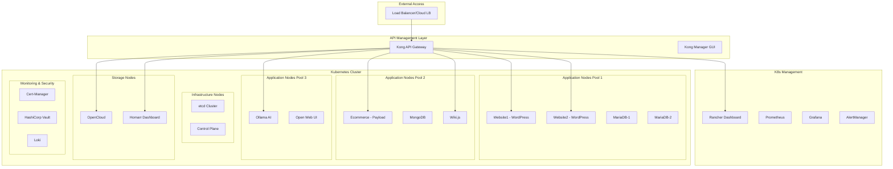

I'll create a high-level architecture diagram using Mermaid and then explain each component's role and responsibilities.

Let's break down each component's roles and responsibilities:

1. **External Access Layer**
   - Load Balancer: Handles incoming traffic distribution and SSL termination
   - Provides DDoS protection and initial security layer

2. **API Management Layer**
   - Kong API Gateway:
     - Central routing for all services
     - Rate limiting
     - Authentication/Authorization
     - Traffic control and policies
   - Kong Manager GUI:
     - Visual management of routes, plugins, and consumers
     - Monitoring API traffic
     - Configuration management

3. **Kubernetes Management**
   - Rancher Dashboard:
     - Kubernetes cluster management
     - Workload deployment and monitoring
     - Access control and user management
   - Monitoring Stack:
     - Prometheus: Metrics collection
     - Grafana: Visualization and dashboards
     - AlertManager: Alert routing and notifications

4. **Infrastructure Nodes**
   - etcd Cluster: Kubernetes state storage
   - Control Plane: Kubernetes master components

5. **Application Node Pools**
   - Pool 1 (WordPress Services):
     - Separate WordPress instances with dedicated MariaDB
     - Resource isolation
   - Pool 2 (Data-intensive Services):
     - Payload CMS with MongoDB
     - Wiki.js application
   - Pool 3 (AI/ML Workloads):
     - Ollama AI service
     - Web UI interface

6. **Storage Nodes**
   - OpenCloud:
     - File management system
     - Object storage interface
   - Homarr:
     - User dashboard
     - Service discovery

7. **Monitoring & Security**
   - Cert-Manager:
     - SSL certificate automation
     - Certificate lifecycle management
   - HashiCorp Vault:
     - Secrets management
     - Encryption as a service
   - Loki:
     - Log aggregation
     - Log search and analysis

Best Practices Implemented:

1. **Security**
   - Network policies for pod-to-pod communication
   - RBAC for access control
   - Secrets management with Vault
   - SSL/TLS encryption throughout
   - Regular security scanning

2. **High Availability**
   - Multiple nodes for redundancy
   - Pod anti-affinity rules
   - Distributed storage
   - Load balancing

3. **Monitoring**
   - Comprehensive metrics collection
   - Log aggregation
   - Alert management
   - Performance monitoring
   - Resource utilization tracking

4. **Scalability**
   - Horizontal pod autoscaling
   - Node autoscaling
   - Resource quotas and limits
   - Separate node pools for different workloads

5. **Maintenance**
   - Rolling updates
   - Backup and restore procedures
   - Disaster recovery planning
   - Configuration management

This architecture provides a robust, secure, and manageable environment for your SMB applications while following cloud-native best practices and ensuring proper resource isolation and monitoring.