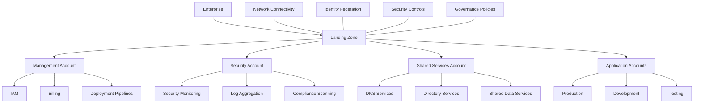

# Cloud Landing Zone Architecture

A cloud landing zone is a pre-configured, standardized, and secure environment in the cloud that serves as a foundation for deploying workloads, applications, and other cloud resources. It provides organizations with a well-architected starting point for their cloud journey, allowing them to focus on business objectives rather than infrastructure setup.

## Overview

Cloud landing zones establish the foundational infrastructure that enables organizations to operate securely and efficiently in the cloud. They incorporate:

- Standardized security controls and policies
- Well-defined network architecture
- Identity and access management frameworks
- Governance and compliance guardrails
- Resource organization and hierarchy
- Logging and monitoring capabilities
- Cost management structures

## Core Components

### 1. Account Structure

Most landing zones implement a multi-account strategy to isolate workloads, separate concerns, and manage access boundaries. This typically includes:

- Management accounts for centralized governance
- Security accounts for audit and monitoring
- Shared service accounts for common resources
- Application accounts for specific workloads

### 2. Identity and Access Management

Identity and Access Management (IAM) is critical for controlling who can access what resources:

- Centralized identity management
- Role-based access control
- Principle of least privilege
- Federation with corporate identity providers

### 3. Network Architecture

Secure network design is fundamental:

- Virtual private clouds (VPCs) with proper segmentation
- Transit gateways for inter-VPC communication
- Public/private subnet organization
- Network security controls (firewalls, NACLs)
- VPN or direct connections to on-premises networks

### 4. Security Controls

Comprehensive security measures:

- Encryption standards (at rest and in transit)
- Security monitoring and alerting
- Vulnerability management
- Compliance scanning

### 5. Governance Framework

Rules and policies that ensure proper resource management:

- Service control policies
- Resource tagging strategies
- Compliance policies
- Cost management

## Implementation Architecture

## Key Tools and Technologies

### Infrastructure as Code (IaC)

#### Terraform

Terraform is the leading IaC tool for cloud landing zone implementation:

- Declarative language for defining infrastructure
- Provider system supporting all major cloud platforms
- State management for tracking deployed resources
- Modules for reusable components
- Integration with CI/CD pipelines

#### AWS CloudFormation / Azure ARM Templates

Cloud-specific IaC solutions:

- Native integration with respective cloud services
- Built-in validation and dependency management

#### Pulumi

Code-first approach using familiar programming languages (Python, TypeScript, etc.)

### Resources Configuration Management

#### Ansible

Ideal for configuring resources within your landing zone:

- Agentless architecture
- Simple YAML syntax
- Extensive module library
- Cross-platform support
- Idempotent operations

#### Chef/Puppet

Alternative configuration management tools for more complex environments

### Identity Management

#### OKTA

Enterprise-grade identity solution that integrates well with cloud landing zones:

- Single sign-on capabilities
- Multi-factor authentication
- User lifecycle management
- API access management
- Adaptive authentication

#### Azure AD / AWS IAM Identity Center

Cloud-native identity providers:

- Seamless integration with respective cloud platforms
- Role-based access controls
- Conditional access policies

### Security and Compliance

#### Cloud Security Posture Management (CSPM)

Tools like Prisma Cloud, Wiz, or native services:

- Continuous compliance monitoring
- Security posture assessment
- Misconfiguration detection
- Threat detection

#### HashiCorp Vault

Secrets management for secure credential storage:

- Dynamic secrets generation
- Secret rotation
- Encryption as a service

### Monitoring and Observability

#### Prometheus & Grafana

Open-source monitoring and visualization:

- Metrics collection
- Alerting capabilities
- Customizable dashboards

#### Datadog / New Relic

Commercial observability platforms:

- Full-stack monitoring
- Application performance monitoring
- Distributed tracing

### CI/CD and Automation

#### GitHub Actions / GitLab CI

Pipeline tools for automating deployment:

- Integration with source control
- Workflow automation
- Infrastructure deployment
- Testing integration

#### Jenkins

Flexible automation server:

- Extensive plugin ecosystem
- Custom pipeline definitions

## Best Practices

1. **Start with Security**: Build security into your landing zone from the beginning, not as an afterthought.

2. **Automate Everything**: Use IaC and automation to ensure consistency and repeatability.

3. **Document Thoroughly**: Maintain comprehensive documentation for your landing zone architecture.

4. **Plan for Scale**: Design with future growth in mind, ensuring your architecture can accommodate expansion.

5. **Implement Tagging**: Develop and enforce a tagging strategy for resource organization and cost allocation.

6. **Regular Compliance Checks**: Schedule automated compliance scans to ensure ongoing adherence to policies.

7. **Multi-Account Strategy**: Isolate workloads and concerns through a well-planned account structure.

8. **Centralized Logging**: Aggregate logs from all accounts to a central location for analysis and audit.

9. **Least Privilege Access**: Grant only the permissions needed for specific roles and functions.

10. **Landing Zone as a Product**: Treat your landing zone as a product with versions, releases, and improvements.

## Conclusion

A well-designed cloud landing zone provides the foundation for successful cloud adoption and operation. By leveraging tools like Terraform for infrastructure provisioning, Ansible for configuration management, and OKTA for identity management, organizations can build secure, scalable, and governed environments that enable innovation while maintaining control.

The investment in a properly architected landing zone pays dividends through improved security posture, operational efficiency, and the ability to rapidly deploy new workloads in a consistent environment.
